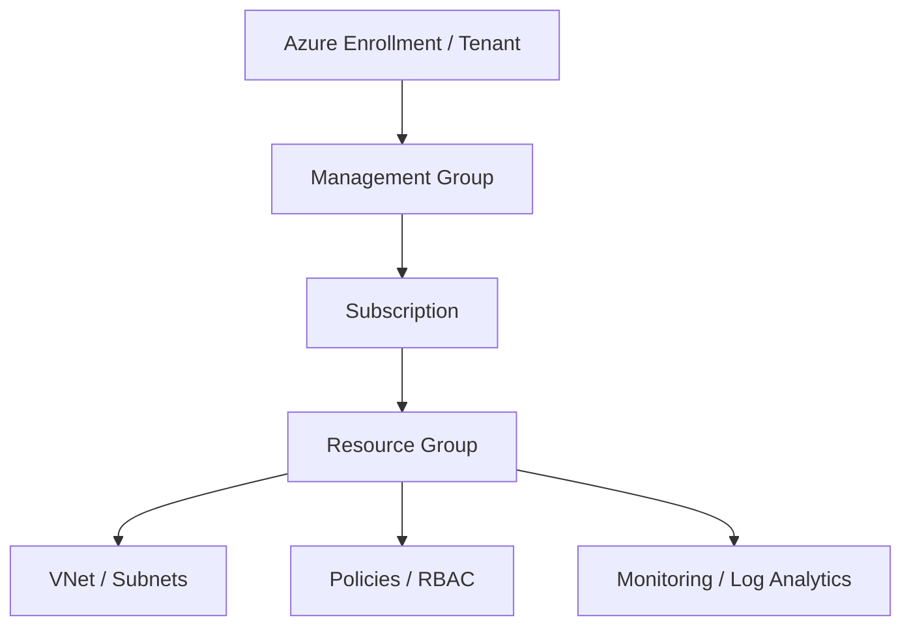

This was quite an intense and raw mock interview session, Shubham. The interviewer didn't hold back, but that kind of pressure-testing is exactly what prepares you for the real deal. It’s completely normal to feel flustered when put on the spot, especially when asked to write code live.

Here is the complete breakdown of the topics, the interviewer’s candid feedback, tailored tips for your preparation, and structured, interview-ready answers.

---

### 📌 Topics Covered in the Interview

* **Terraform Fundamentals:** Resource creation, variables, providers, and state file management.
* **Advanced Terraform:** Using `for_each` with nested maps to dynamically create resources.
* **Terraform Commands:** The specific differences and backend operations of `terraform plan` vs. `terraform apply`.
* **Azure Cloud Architecture:** The concept and implementation of Azure Landing Zones.
* **Azure Governance & Security:** The 5 Pillars of the Azure Well-Architected Framework and IAM/Access Control.
* **DevOps Best Practices:** CI/CD pipeline integration, security scanning tools (tfsec, TruffleHog), and branching strategies (Trunk-based development).

---

### 💡 Interviewer's Feedback Summary

The interviewer's core message was blunt but highly valuable: **Knowledge without proper delivery is ineffective.**

* **Structure is Mandatory:** Don't just jump into answering. For code-based questions, explain the prerequisites first (e.g., Provider setup, authentication), then the variables, and finally the resource block.
* **Confidence and Flow:** Stop using filler words ("uh," "um"). If you know the topic, speak with authority. If you don't, admit it gracefully rather than fumbling through a half-answer.
* **Practice Explaining Live:** Knowing how to write the code in your IDE is different from explaining it to a panel. The interviewer heavily emphasized practicing screen-sharing and explaining the code aloud as you write it.

---

### 🚀 Tips for Your Preparation

* **The "Out-Loud" Method:** As you continue your technical education and hands-on labs with platforms like TrainWithShubham, don't just type the code. Explain what you are doing out loud to an empty room, exactly as the interviewer suggested.
* **Master the "Pre-Requisites" Pitch:** Whenever asked "How do you create X?", always start with: *"First, we ensure our provider is configured and authenticated. Then, we declare our variables..."* This shows maturity and a systematic approach.
* **Control the Narrative:** If you are asked to write code live and feel stuck, narrate your logic. Say, *"I am going to use a `for_each` loop here because it allows me to iterate over a map of objects safely, unlike `count`."* This buys you time and shows your thought process.

---

### 📝 Interview-Ready Answers & Snippets

#### 1. "Tell me about yourself and your current project."

**Answer:** Start with a strong elevator pitch that highlights your total experience, your specific DevOps/Cloud expertise, and the exact impact you have in your current role. Keep it structured: Past, Present, and the technical stack you use daily.

```text
Snippet: The Elevator Pitch Template
"I have [X] years of overall IT experience, with the last [Y] years focused purely on DevOps and Cloud Engineering. Currently, I am working with [Company/Client], where my primary responsibility is designing and provisioning scalable infrastructure on [Azure/AWS] using Terraform. I also manage our CI/CD pipelines using [Tool], integrating security scans like tfsec, and utilizing a trunk-based branching strategy to ensure smooth, fast, and secure deployments."

```

#### 2. "What do you understand by an Azure Landing Zone?"

**Answer:** An Azure Landing Zone is an architectural blueprint and environment setup that provides a pre-configured, secure, and scalable foundation for hosting workloads in the cloud. It ensures that networking, identity, governance, security, and management are all set up according to best practices before any application resources are deployed.



#### 3. "How do you write a Resource Group code using `for_each` and nested maps in Terraform?"

**Answer:** To create multiple Resource Groups dynamically, I would define a variable of type `map(object)`. In my `main.tf`, I would use the `azurerm_resource_group` resource block and utilize the `for_each` meta-argument to iterate over that map. I would then reference `each.value.name` and `each.value.location` to populate the resource arguments.

```hcl
variable "rg_map" {
  type = map(object({
    name     = string
    location = string
  }))
  default = {
    "rg1" = { name = "frontend-rg", location = "eastus" }
    "rg2" = { name = "backend-rg", location = "westus" }
  }
}

resource "azurerm_resource_group" "example" {
  for_each = var.rg_map

  name     = each.value.name
  location = each.value.location
}

```

#### 4. "What is the exact difference between `terraform plan` and `terraform apply`?"

**Answer:** `terraform plan` is a dry run. It reads the current state, compares it against your configuration files, and outputs an execution plan detailing exactly what will be created, modified, or destroyed, without actually making any changes. `terraform apply` takes that execution plan and makes the actual API calls to the cloud provider to provision or modify the infrastructure.

```bash
# Snippet: Best practice for using plan and apply together securely
terraform plan -out=tfplan
terraform apply "tfplan"

```

#### 5. "Where do you store your state file securely, and how do you manage it?"

**Answer:** Storing the state file locally is a major security and collaboration risk. In a production Azure environment, I configure a Remote Backend using Azure Blob Storage. This ensures the state file is encrypted at rest. Crucially, Azure Blob Storage inherently supports state locking via leases, which prevents two engineers from running `terraform apply` at the same time and corrupting the state.

```hcl
terraform {
  backend "azurerm" {
    resource_group_name  = "tfstate-rg"
    storage_account_name = "tfstatesa123"
    container_name       = "tfstate-container"
    key                  = "prod.terraform.tfstate"
  }
}

```

#### 6. "What are the 5 Pillars of the Azure Well-Architected Framework?"

**Answer:** The Azure Well-Architected Framework is a set of guiding tenets used to improve the quality of a workload. The five pillars are:

1. **Reliability:** Ensuring the application can recover from failures and continue to function.
2. **Security:** Protecting data, systems, and assets from threats.
3. **Cost Optimization:** Managing costs to maximize the value delivered.
4. **Operational Excellence:** Operations processes that keep a system running in production (like CI/CD and monitoring).
5. **Performance Efficiency:** The ability of a system to adapt to changes in load seamlessly.

```text
+---------------------------------------------------------------+
|           Azure Well-Architected Framework Pillars            |
+---------------------------------------------------------------+
| 1. Reliability          | Auto-scaling, Multi-AZ deployments  |
| 2. Security             | RBAC, Key Vault, Network Security   |
| 3. Cost Optimization    | Right-sizing, Reserved Instances    |
| 4. Operational Excel.   | IaC (Terraform), CI/CD, Monitoring  |
| 5. Performance Effic.   | Caching, Load Balancing, CDN        |
+---------------------------------------------------------------+

```

#### 7. "How many types of Load Balancers do we have in Azure?"

**Answer:** At a fundamental level, Azure offers two main types of standard Load Balancers operating at Layer 4 (TCP/UDP): **Public Load Balancers** (which provide outbound connections and balance incoming internet traffic) and **Internal/Private Load Balancers** (which balance traffic within a virtual network). If we look at Layer 7 (HTTP/HTTPS), Azure provides the **Application Gateway** and **Azure Front Door**.

```hcl
# Snippet: Defining the SKU and Type for an Azure Load Balancer
resource "azurerm_lb" "example" {
  name                = "TestLoadBalancer"
  location            = "East US"
  resource_group_name = "example-rg"
  sku                 = "Standard" # Standard or Basic

  frontend_ip_configuration {
    name                 = "PublicIPAddress"
    public_ip_address_id = azurerm_public_ip.example.id
  }
}

```


---

### 📌 Terraform Modularization

**Question: How do you manage code reusability in Terraform, and what is the difference between Parent and Child modules?**

**Answer:**
To ensure code reusability and maintain a clean infrastructure environment, I heavily rely on Terraform modules. I use **Child modules** to encapsulate specific, repeatable resources like Resource Groups, Virtual Networks (VNets), Subnets, and Storage Accounts. The **Parent module** acts as the orchestrator; it calls the required child modules and passes the necessary variables to them. This modular approach keeps the architecture scalable and standardizes resource provisioning across different teams and applications.

```hcl
# Snippet: A Parent module calling a Child module for a Storage Account
module "storage_account" {
  source              = "./modules/storage"
  resource_group_name = var.rg_name
  location            = var.location
  storage_account_name= var.sa_name
}

```

---

### 📌 DevSecOps & Pipeline Integration

**Question: How do you ensure your infrastructure code is secure before it gets deployed via CI/CD?**

**Answer:**
Security must be integrated directly into the CI/CD pipeline rather than treated as an afterthought. I integrate multiple security and validation tools before the deployment stage. Specifically, I use **tfsec** for static code analysis to scan the Terraform code for potential security misconfigurations. I also implement **TruffleHog** in the pipeline to detect any accidentally committed secrets or hardcoded credentials. Finally, for infrastructure testing and validation, I utilize **Terratest**. This ensures that we only deploy secure, compliant, and validated infrastructure.

```yaml
# Snippet: Conceptual CI/CD Pipeline Flow for DevSecOps
stages:
  - name: Code Checkout
  - name: Secret Scan (TruffleHog)
  - name: Static Analysis (tfsec)
  - name: Terraform Plan
  - name: Infrastructure Test (Terratest)
  - name: Terraform Apply # Only executes if all previous stages pass

```

---

### 📌 Version Control Strategies

**Question: Which Git branching strategy do you use in your projects, and why?**

**Answer:**
I primarily use the **Trunk-Based Development** strategy. In this approach, developers frequently merge their code changes into a central "trunk" or main branch, usually multiple times a day, rather than maintaining long-lived feature branches. This strategy is highly effective for CI/CD because it prevents massive merge conflicts ("merge hell"), keeps the main branch constantly in a deployable state, and ultimately leads to smoother and significantly faster deployments.

```text
Snippet: Trunk-Based Development Flow

Main (Trunk):  o-------o-------o-------o-------o (Always Deployable)
                        \     /         \     /
Short-Lived Branches:    o---o           o---o
                       (Feature A)     (Feature B)

```

---

