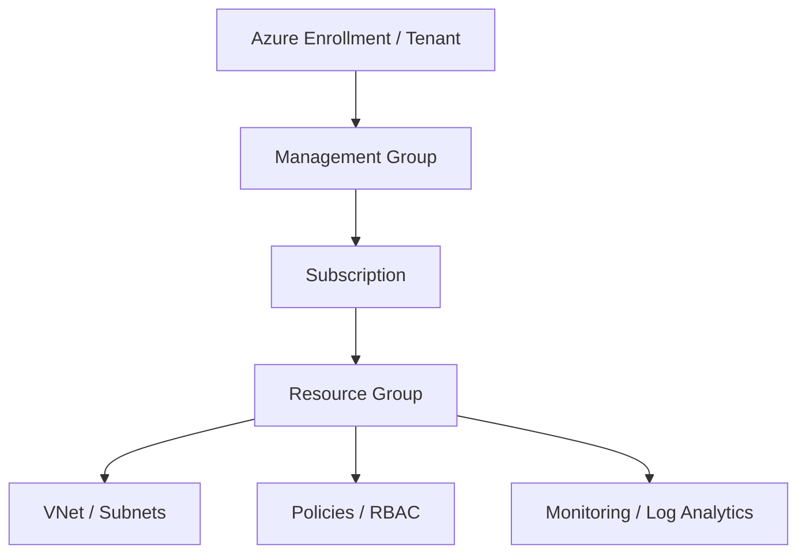

This was quite an intense and raw mock interview session, Shubham. The interviewer didn't hold back, but that kind of pressure-testing is exactly what prepares you for the real deal. It’s completely normal to feel flustered when put on the spot, especially when asked to write code live.

Here is the complete breakdown of the topics, the interviewer’s candid feedback, tailored tips for your preparation, and structured, interview-ready answers.

---

### 📌 Topics Covered in the Interview

* **Terraform Fundamentals:** Resource creation, variables, providers, and state file management.
* **Advanced Terraform:** Using `for_each` with nested maps to dynamically create resources.
* **Terraform Commands:** The specific differences and backend operations of `terraform plan` vs. `terraform apply`.
* **Azure Cloud Architecture:** The concept and implementation of Azure Landing Zones.
* **Azure Governance & Security:** The 5 Pillars of the Azure Well-Architected Framework and IAM/Access Control.
* **DevOps Best Practices:** CI/CD pipeline integration, security scanning tools (tfsec, TruffleHog), and branching strategies (Trunk-based development).

---

### 💡 Interviewer's Feedback Summary

The interviewer's core message was blunt but highly valuable: **Knowledge without proper delivery is ineffective.**

* **Structure is Mandatory:** Don't just jump into answering. For code-based questions, explain the prerequisites first (e.g., Provider setup, authentication), then the variables, and finally the resource block.
* **Confidence and Flow:** Stop using filler words ("uh," "um"). If you know the topic, speak with authority. If you don't, admit it gracefully rather than fumbling through a half-answer.
* **Practice Explaining Live:** Knowing how to write the code in your IDE is different from explaining it to a panel. The interviewer heavily emphasized practicing screen-sharing and explaining the code aloud as you write it.

---

### 🚀 Tips for Your Preparation

* **The "Out-Loud" Method:** As you continue your technical education and hands-on labs with platforms like TrainWithShubham, don't just type the code. Explain what you are doing out loud to an empty room, exactly as the interviewer suggested.
* **Master the "Pre-Requisites" Pitch:** Whenever asked "How do you create X?", always start with: *"First, we ensure our provider is configured and authenticated. Then, we declare our variables..."* This shows maturity and a systematic approach.
* **Control the Narrative:** If you are asked to write code live and feel stuck, narrate your logic. Say, *"I am going to use a `for_each` loop here because it allows me to iterate over a map of objects safely, unlike `count`."* This buys you time and shows your thought process.

---

### 📝 Interview-Ready Answers & Snippets

#### 1. "Tell me about yourself and your current project."

**Answer:** Start with a strong elevator pitch that highlights your total experience, your specific DevOps/Cloud expertise, and the exact impact you have in your current role. Keep it structured: Past, Present, and the technical stack you use daily.

```text
Snippet: The Elevator Pitch Template
"I have [X] years of overall IT experience, with the last [Y] years focused purely on DevOps and Cloud Engineering. Currently, I am working with [Company/Client], where my primary responsibility is designing and provisioning scalable infrastructure on [Azure/AWS] using Terraform. I also manage our CI/CD pipelines using [Tool], integrating security scans like tfsec, and utilizing a trunk-based branching strategy to ensure smooth, fast, and secure deployments."

```

#### 2. "What do you understand by an Azure Landing Zone?"

**Answer:** An Azure Landing Zone is an architectural blueprint and environment setup that provides a pre-configured, secure, and scalable foundation for hosting workloads in the cloud. It ensures that networking, identity, governance, security, and management are all set up according to best practices before any application resources are deployed.



#### 3. "How do you write a Resource Group code using `for_each` and nested maps in Terraform?"

**Answer:** To create multiple Resource Groups dynamically, I would define a variable of type `map(object)`. In my `main.tf`, I would use the `azurerm_resource_group` resource block and utilize the `for_each` meta-argument to iterate over that map. I would then reference `each.value.name` and `each.value.location` to populate the resource arguments.

```hcl
variable "rg_map" {
  type = map(object({
    name     = string
    location = string
  }))
  default = {
    "rg1" = { name = "frontend-rg", location = "eastus" }
    "rg2" = { name = "backend-rg", location = "westus" }
  }
}

resource "azurerm_resource_group" "example" {
  for_each = var.rg_map

  name     = each.value.name
  location = each.value.location
}

```

#### 4. "What is the exact difference between `terraform plan` and `terraform apply`?"

**Answer:** `terraform plan` is a dry run. It reads the current state, compares it against your configuration files, and outputs an execution plan detailing exactly what will be created, modified, or destroyed, without actually making any changes. `terraform apply` takes that execution plan and makes the actual API calls to the cloud provider to provision or modify the infrastructure.

```bash
# Snippet: Best practice for using plan and apply together securely
terraform plan -out=tfplan
terraform apply "tfplan"

```

#### 5. "Where do you store your state file securely, and how do you manage it?"

**Answer:** Storing the state file locally is a major security and collaboration risk. In a production Azure environment, I configure a Remote Backend using Azure Blob Storage. This ensures the state file is encrypted at rest. Crucially, Azure Blob Storage inherently supports state locking via leases, which prevents two engineers from running `terraform apply` at the same time and corrupting the state.

```hcl
terraform {
  backend "azurerm" {
    resource_group_name  = "tfstate-rg"
    storage_account_name = "tfstatesa123"
    container_name       = "tfstate-container"
    key                  = "prod.terraform.tfstate"
  }
}

```

#### 6. "What are the 5 Pillars of the Azure Well-Architected Framework?"

**Answer:** The Azure Well-Architected Framework is a set of guiding tenets used to improve the quality of a workload. The five pillars are:

1. **Reliability:** Ensuring the application can recover from failures and continue to function.
2. **Security:** Protecting data, systems, and assets from threats.
3. **Cost Optimization:** Managing costs to maximize the value delivered.
4. **Operational Excellence:** Operations processes that keep a system running in production (like CI/CD and monitoring).
5. **Performance Efficiency:** The ability of a system to adapt to changes in load seamlessly.

```text
+---------------------------------------------------------------+
|           Azure Well-Architected Framework Pillars            |
+---------------------------------------------------------------+
| 1. Reliability          | Auto-scaling, Multi-AZ deployments  |
| 2. Security             | RBAC, Key Vault, Network Security   |
| 3. Cost Optimization    | Right-sizing, Reserved Instances    |
| 4. Operational Excel.   | IaC (Terraform), CI/CD, Monitoring  |
| 5. Performance Effic.   | Caching, Load Balancing, CDN        |
+---------------------------------------------------------------+

```

#### 7. "How many types of Load Balancers do we have in Azure?"

**Answer:** At a fundamental level, Azure offers two main types of standard Load Balancers operating at Layer 4 (TCP/UDP): **Public Load Balancers** (which provide outbound connections and balance incoming internet traffic) and **Internal/Private Load Balancers** (which balance traffic within a virtual network). If we look at Layer 7 (HTTP/HTTPS), Azure provides the **Application Gateway** and **Azure Front Door**.

```hcl
# Snippet: Defining the SKU and Type for an Azure Load Balancer
resource "azurerm_lb" "example" {
  name                = "TestLoadBalancer"
  location            = "East US"
  resource_group_name = "example-rg"
  sku                 = "Standard" # Standard or Basic

  frontend_ip_configuration {
    name                 = "PublicIPAddress"
    public_ip_address_id = azurerm_public_ip.example.id
  }
}

```


---

### 📌 Terraform Modularization

**Question: How do you manage code reusability in Terraform, and what is the difference between Parent and Child modules?**

**Answer:**
To ensure code reusability and maintain a clean infrastructure environment, I heavily rely on Terraform modules. I use **Child modules** to encapsulate specific, repeatable resources like Resource Groups, Virtual Networks (VNets), Subnets, and Storage Accounts. The **Parent module** acts as the orchestrator; it calls the required child modules and passes the necessary variables to them. This modular approach keeps the architecture scalable and standardizes resource provisioning across different teams and applications.

```hcl
# Snippet: A Parent module calling a Child module for a Storage Account
module "storage_account" {
  source              = "./modules/storage"
  resource_group_name = var.rg_name
  location            = var.location
  storage_account_name= var.sa_name
}

```

---

### 📌 DevSecOps & Pipeline Integration

**Question: How do you ensure your infrastructure code is secure before it gets deployed via CI/CD?**

**Answer:**
Security must be integrated directly into the CI/CD pipeline rather than treated as an afterthought. I integrate multiple security and validation tools before the deployment stage. Specifically, I use **tfsec** for static code analysis to scan the Terraform code for potential security misconfigurations. I also implement **TruffleHog** in the pipeline to detect any accidentally committed secrets or hardcoded credentials. Finally, for infrastructure testing and validation, I utilize **Terratest**. This ensures that we only deploy secure, compliant, and validated infrastructure.

```yaml
# Snippet: Conceptual CI/CD Pipeline Flow for DevSecOps
stages:
  - name: Code Checkout
  - name: Secret Scan (TruffleHog)
  - name: Static Analysis (tfsec)
  - name: Terraform Plan
  - name: Infrastructure Test (Terratest)
  - name: Terraform Apply # Only executes if all previous stages pass

```

---

### 📌 Version Control Strategies

**Question: Which Git branching strategy do you use in your projects, and why?**

**Answer:**
I primarily use the **Trunk-Based Development** strategy. In this approach, developers frequently merge their code changes into a central "trunk" or main branch, usually multiple times a day, rather than maintaining long-lived feature branches. This strategy is highly effective for CI/CD because it prevents massive merge conflicts ("merge hell"), keeps the main branch constantly in a deployable state, and ultimately leads to smoother and significantly faster deployments.

```text
Snippet: Trunk-Based Development Flow

Main (Trunk):  o-------o-------o-------o-------o (Always Deployable)
                        \     /         \     /
Short-Lived Branches:    o---o           o---o
                       (Feature A)     (Feature B)

```

---

# Next part

Here is the finalized interview playbook containing every technical question raised or discussed by the mentors and candidates in the **10Interview_Part_1.mp4** session.

The answers below are fully re-engineered to reflect the depth, terminology, architectural foresight, and governance considerations expected of an elite cloud infrastructure engineer or tech lead with **10+ years of experience**.

---

## 1. Global vs. Regional Load Balancing Architecture

> **Question:** Can you explain the architectural distinctions between Azure Application Gateway, Azure Front Door, and standard Load Balancers? How do you choose between them for an enterprise use case?

### Elite Architectural Answer

"In enterprise-scale topologies, we separate traffic management into **Global Edge Routing** and **Regional Layer 4/Layer 7 Load Balancing**.

* **Azure Front Door (Global Layer 7):** This is our global entry point. It operates at the edge using Anycast Any-Routing and split-TCP via Microsoft’s global WAN. It provides global HTTP/HTTPS routing, SSL offloading, and a Global Web Application Firewall (WAF) to block SQL injections and cross-site scripting before traffic ever enters our cloud region.
* **Azure Application Gateway (Regional Layer 7):** This manages application routing *within* a specific region. It operates at the application layer, giving us advanced URL-path-based routing, cookie-based session affinity, rewrite headers, and regional WAF protection. It sits directly inside a dedicated subnet to securely manage the localized backend pool (e.g., Virtual Machine Scale Sets or AKS ingress).
* **Azure Load Balancer (Regional Layer 4):** Operating purely at the transport layer (TCP/UDP), this is used for ultra-low latency, high-throughput packet routing. It doesn't inspect HTTP headers or handle SSL termination; it is strictly used to distribute raw backend infrastructure traffic."

### Architectural Layouts

#### High-Level Design (HLD): Global Ingress & Traffic Routing

```
                          [ Global Users ]
                                  │
                                  ▼
                     [ Azure Front Door + WAF ]
                                  │
         ┌────────────────────────┴────────────────────────┐
         ▼ (Region: East US)                               ▼ (Region: West US)
[ App Gateway Subnet ]                             [ App Gateway Subnet ]
   (URL Path-Based)                                   (URL Path-Based)
         │                                                 │
   ┌─────┴─────┐                                           ├─────► [ Private AKS Cluster ]
   ▼           ▼                                           │
[VM Pool]   [App Service]                                  └─────► [ VM Scale Sets ]

```

---

## 2. Platform Resiliency & Storage Recovery

> **Question:** If a storage account is accidentally deleted, what is your immediate recovery option in Azure, what is the retention period, and how do you protect it at scale?

### Elite Architectural Answer

"For any enterprise environment under my supervision, the primary solution is **preventative automation**. We mandate an implicit **Azure Resource Lock (`CanNotDelete`)** via Terraform on every business-critical storage resource.

If a storage account is somehow deleted, the recovery strategy depends on platform configurations:

* **The Soft-Delete Window:** Azure includes a built-in soft-delete capability for the storage account resource itself. The default retention window is **14 days**. Within this timeframe, we can restore the deleted storage account directly via the Azure CLI, PowerShell, or the 'Deleted Storage Accounts' blade in the portal. The restore succeeds as long as a new account with the same name hasn't been created in the active tenant space.
* **Immutable Backups:** If the soft-delete window is passed or the account was permanently expunged, operational continuity relies on our secondary guardrail: a point-in-time restore from a locked **Azure Recovery Services Vault** where backup snapshots are protected using Geo-Redundant Storage (GRS) settings."

### State Machine Layout

#### Low-Level Design (LLD): Storage Deletion Lifecycle

```
 [ Active Storage ] ───( Admin Oversight / Accident )───► [ Soft-Deleted State ]
         ▲                                                       │
         │                                           (Within 14-Day Boundary)
         └─────────────[ Trigger Undelete Action ]───────────────┤
                                                                 ▼ (T > 14 Days)
                                                          [ Hard Purged State ]
                                                                 │
                                                    (Vault Recovery Protocol)
                                                                 ▼
                                                    [ Recovered V2 Infrastructure ]

```

---

## 3. Storage Tiering & Backup Automation

> **Question:** How do you orchestrate backups? Do you favor a daily or monthly backup frequency, and how do you optimize data lifecycle costs?

### Elite Architectural Answer

"We implement a multi-tiered backup framework designed to balance two competing priorities: rapid operational recovery (RTO) and long-term regulatory compliance cost-management.

* **Operational Tier (Daily):** We configure automated daily incremental snapshots with a rolling retention of 14 days directly on active volumes to handle standard file-corruption or deployment failure recovery.
* **Compliance Tier (Grandfather-Father-Son):** Long-term historical data is offloaded to an immutable recovery vault on a weekly, monthly, and yearly cadence, retained for up to 7 years.
* **Automated Storage Tiering via Lifecycle Management:** To optimize costs at scale, we use automated **Azure Blob Lifecycle Management policies** written in JSON/Terraform. Data lands in the **Hot Tier** for active workloads. If unaccessed for 30 days, it is moved to the **Cool Tier**. After 90 days of inactivity, the policy automatically down-tiers objects to the **Archive Tier**, minimizing long-term storage costs."

#### High-Level Design (HLD): Storage Lifecycle Pipeline

```
[ Compute Resources ] ──► [ Blob Storage / Ingestion Layer ] (Hot Tier)
                                     │
         ┌───────────────────────────┴───────────────────────────┐
         ▼ (T > 30 Days Inactivity)                              ▼ (T > 90 Days)
   [ Cool Sub-Tier ] (Lower Access Fee)                    [ Archive Sub-Tier ]
         │                                                   (WORM / Offline Storage)
         ▼ (Automated Vault Policy)                              │
[ Recovery Services Vault ] ◄────────────────────────────────────┘
 (Long-Term Retention: 7 Years)

```

---

## 4. Multi-Region Disaster Recovery Blueprint

> **Question:** Can you explain your organization's Disaster Recovery (DR) strategy? How do you combine Blue-Green deployment models with regional failover?

### Elite Architectural Answer

"We target an **RTO of < 5 minutes** and an **RPO of near-zero** for business-critical applications by pairing regional Blue-Green architectures with a **Cross-Region Active-Passive (Warm Standby)** DR topology.

* **Blue-Green Deployment Model:** Locally within our active region, our infrastructure is divided into two identical, isolated environments. Live production traffic targets the 'Blue' stack. Code upgrades are deployed to 'Green'. Once validation checks pass, we use an upstream routing engine (Azure App Gateway or Front Door) to shift the traffic weight smoothly from Blue to Green. This eliminates maintenance windows and allows for instant rollbacks if unexpected issues arise.
* **Cross-Region DR Failover:** Downstream data tiers are synchronously or asynchronously mirrored across Azure paired regions using **Azure SQL Active Geo-Replication** or Cosmos DB multi-region writes. Compute infrastructure states are continually tracked via **Azure Site Recovery (ASR)**. Upstream, global traffic manager health probes actively monitor region health; if the primary region goes offline, traffic is automatically re-routed to the recovery region."

#### High-Level Design (HLD): Active-Passive Multi-Region Disaster Recovery

```
                             [ Global Traffic Ingress ]
                                         │
                                         ▼
                            [ Azure Front Door / Traffic Engine ]
                                         │
         ┌───────────────────────────────┴───────────────────────────────┐
         ▼ (Primary Region: Active)                                      ▼ (DR Region: Passive Standby)
[ Regional App Gateway ]                                         [ Regional App Gateway ]
         │                                                               │
   ┌─────┴─────┐ (Blue/Green Deployment)                                 │
   ▼           ▼                                                         ▼
[Blue]      [Green]                                              [Compute Standby Stack]
(Live)     (Staging)                                                     ▲
   │                                                                     │
   ▼                                                                     │ (ASR Replicated)
[ Primary Database Tier ] ─────────(Geo-Replication Sync)───────────────┘

```

---

## 5. Architectural Self-Introduction

> **Question:** Provide a brief architectural summary of your experience, project use cases, and your day-to-day operational activities.

### Elite Professional Answer

"I am an infrastructure and cloud platform professional with over **10 years of experience**, specializing in designing enterprise-scale infrastructure platform automation, multi-region secure cloud migrations, and highly resilient CI/CD pipelines.

My primary focus revolves around architecting and automating **Azure Enterprise Landing Zones** using a structured **Infrastructure as Code (IaC)** pipeline with Terraform. I lead teams in decomposing monolithic on-premises footprints into containerized and cloud-native workloads within Azure, integrating comprehensive governance via Azure Policies, and enforcing a strict zero-trust model using micro-segmentation.

My day-to-day operational framework consists of:

* Leading architectural review boards to evaluate cloud topology designs for security and scale.
* Authoring scalable, reusable Terraform modules using advanced structural logic (`for_each`, dynamic blocks, explicit dependencies) to enforce company infrastructure standards.
* Developing secure, automated CI/CD multi-stage pipelines (e.g., Azure DevOps, GitHub Actions) featuring integrated static analysis scanning (e.g., Checkov, TFSec, TFLint) and mandatory multi-party approval gates.
* Analyzing global platform telemetry logs (Log Analytics Workspace, Grafana dashboards) to identify, isolate, and remediate systemic scaling or performance bottlenecks."

---

## 6. Secure Enterprise Landing Zone Infrastructure

> **Question:** Design a network architecture blueprint for an enterprise cloud Landing Zone migrating workloads from on-premises environments. Focus on topology, traffic isolation, routing mechanics, and address management.

### Elite Architectural Answer

"To support an enterprise-grade migration, we establish an **Azure Landing Zone using a Hub-and-Spoke architectural topology**. This model isolates core platform tools from application environments while centralizing security perimeters.

1. **Centralized Hub Architecture:** The Hub VNet acts as the shared security perimeter. It contains the **Azure VPN Gateway/ExpressRoute** to connect with on-premises data centers, an **Azure Firewall Premium** for centralized Layer 4/7 inspection, and **Azure Bastion** for isolated management access.
2. **Workload Spoke Isolation:** Spoke VNets host our specific application tiers (e.g., Production, Non-Production). Spokes are completely decoupled from each other and communicate exclusively through the Central Hub via **VNet Peering**.
3. **Strict Traffic Orchestration via UDRs:** By default, subnets inside VNets route traffic directly out to the internet or across peer connections. To enforce security rules, we place custom **User Defined Routes (UDRs)** on all Spoke subnets. We map a default route entry (`0.0.0.0/0`) that sets the Next Hop address to the private IP of the **Central Azure Firewall**. This ensures no packet can enter or leave a Spoke without undergoing deep packet inspection.
4. **CIDR Address Management Strategy:** We plan our IP spaces out carefully to prevent any overlapping with existing on-premises networks. We structure our address allocations into supernets using RFC 1918 space:
* *On-Premises Subnets:* `10.0.0.0/16`
* *Central Azure Hub VNet:* `10.100.0.0/20` (Subdivided into `/24` subnets for gateways and security appliances).
* *Production Spoke VNet:* `10.101.0.0/20` (Divided into dedicated subnets for front-end, app services, and data layers).
* *Non-Production Spoke VNet:* `10.102.0.0/20`


Security is reinforced at the subnet layer using **Network Security Groups (NSGs)** to control traffic, and databases are locked down inside private endpoints with no public internet routes."

### Architectural Layouts

#### High-Level Design (HLD): Landing Zone Topography

```
       [ Corporate On-Prem Data Center ] (10.0.0.0/16)
                             │
                  (ExpressRoute Backbone)
                             │
                             ▼
┌────────────────── Central Hub VNet (10.100.0.0/20) ──────────────────┐
│                                                                      │
│   [ ExpressRoute Gateway ] ◄──► [ Azure Firewall Premium ]           │
│                                      (10.100.4.5)                    │
└──────────────────────────────────────────▲───────────────────────────┘
                                           │
                                           │ (VNet Peering Route Redirection)
                 ┌─────────────────────────┴─────────────────────────┐
                 ▼                                                   ▼
┌───────── Production Spoke (10.101.0.0/20) ────────┐ ┌──────── Non-Production Spoke (10.102.0.0/20) ────┐
│                                                   │ │                                                   │
│ [Web Subnet]  ──► [App Subnet]  ──► [Data Subnet] │ │ [Web Subnet]  ──► [App Subnet]  ──► [Data Subnet] │
│ (10.101.1.0)      (10.101.2.0)      (10.101.3.0)  │ │ (10.102.1.0)      (10.102.2.0)      (10.102.3.0)  │
└───────────────────────────────────────────────────┘ └───────────────────────────────────────────────────┘

```

#### Low-Level Design (LLD): Workload Subnet Traffic Flow

```
[ Traversed Hub Firewall Traffic ] ───► [ Subnet: App Tier (10.101.2.0/24) ]
                                                   │
                                     (Network Security Group - Strict Port Restriction)
                                                   │
                                                   ▼
                                        [ Private Endpoint Interface ]
                                                   │
                                     (Route Table Rule: 0.0.0.0/0 -> Next Hop: 10.100.4.5)
                                                   │
                                                   ▼
                                     [ Subnet: Data Tier (10.101.3.0/24) ]
                                      (Isolated Backend Database Layer)

```


---

# 10th Part 2

---

Based on the second part of your mock interview recording, the interviewer transitions into assessing your understanding of core DevOps tooling, lifecycle architecture, cloud services, and orchestration.

Below are the extracted core questions from this segment, followed by comprehensive, interview-ready answers, interviewer evaluations, expert feedback, tips, and the requested technical code snippets or architectural diagrams.

---

### **Question 1: Explain the typical pipeline stages in a standard CI/CD workflow.**

#### **Interview-Ready Answer**

"A standard CI/CD pipeline acts as the automated backbone of a DevOps lifecycle, transforming raw code into a secure, production-ready product. It is broken down into four foundational stages:

1. **Source/Commit Stage:** Triggered automatically whenever a developer pushes a branch or opens a pull request. Linting tools and static application security testing (SAST) run here to catch basic syntax or formatting violations immediately.
2. **Build Stage:** The application code is compiled along with its dependencies. In containerized environments, this stage builds the Docker image and tags it systematically.
3. **Test Stage:** Automated test suites—including unit tests, integration tests, and basic smoke tests—are executed against the artifact. If any test fails, the pipeline halts immediately, keeping broken code out of downstream environments.
4. **Deploy Stage:** The verified artifact is rolled out to a staging or production environment. In modern cloud setups, this stage often interfaces with configuration management or orchestration tools like Kubernetes using progressive deployment strategies such as Blue-Green or Canary to minimize risk."

#### **Architectural Diagram**

```
[ Developer Push ] ──> 1. SOURCE (Git / Linting / SAST)
                              │
                              ▼
                       2. BUILD (Compile Code / Docker Build)
                              │
                              ▼
                       3. TEST (Unit / Integration Testing)
                              │
                              ▼
                       4. DEPLOY (Canary Rollout to K8s Cluster)

```

#### **Feedback & Performance Tips**

* **Interviewer Evaluation:** Good understanding of sequential progression. Mentions containerization and security boundaries early, which aligns with modern workflows.
* **Our Expert Tips:** When speaking, emphasize the "fail-fast" philosophy. Highlight that the goal of the *Test Stage* is to catch flaws within minutes, avoiding expensive rollouts of broken software.

---

### **Question 2: What is Infrastructure as Code (IaC), and how does Terraform manage state?**

#### **Interview-Ready Answer**

"Infrastructure as Code is the practice of provisioning, managing, and versioning IT infrastructure using machine-readable definition files rather than manual configuration dashboards.

Terraform achieves this through a declarative approach, where you define the desired target state of your architecture. It manages maps between your configuration files and actual real-world resources using a backend metadata registry known as the **State File (`terraform.tfstate`)**.

When you run `terraform plan`, Terraform performs a three-way reconciliation: it reads your local code, reviews the existing state file, and refreshes the state against the cloud provider's real-time API. It then computes the exact delta required to safely transition into your target architecture. In a production environment, keeping the state file secure and concurrent requires configuring a remote backend with distributed state locking."

#### **Production Code Snippet (Terraform Remote State)**

```hcl
# AWS remote backend configuration with S3 state storage and DynamoDB locking
terraform {
  required_version = ">= 1.5.0"
  
  backend "s3" {
    bucket         = "production-devops-tfstate-bucket"
    key            = "infrastructure/networks/terraform.tfstate"
    region         = "ap-south-1" # Bhopal regional proximity
    encrypt        = true
    dynamodb_table = "terraform-state-lock-table"
  }
}

```

#### **Feedback & Performance Tips**

* **Interviewer Evaluation:** Clear, structural explanation. Bringing up remote backends, state locking, and API reconciliation shows real-world engineering exposure over simple textbook theoretical definitions.
* **Our Expert Tips:** Always call out that the state file can contain sensitive data (like database passwords in plain text). Mentioning that access to the S3 bucket must be restricted with IAM policies proves you build with a security-first mindset.

---

### **Question 3: How does Kubernetes handle service discovery and traffic routing to Pods?**

#### **Interview-Ready Answer**

"In Kubernetes, Pods are ephemeral; they are constantly created and destroyed during scaling or rolling updates, meaning their internal IP addresses change constantly. Kubernetes elegantly solves service discovery and traffic routing via the **Service abstraction layer**.

A Kubernetes `Service` uses **Labels and Selectors** to dynamically track active Pod instances. Instead of keeping static lists, the Service continuously targets a dynamic subset of matching Pods.

Behind the scenes, a component running on every cluster node called `kube-proxy` actively listens to the API server. Whenever a Service or an associated Endpoint is created or altered, `kube-proxy` updates the node's local network routing tables (using IPVS or `iptables`). When traffic hits the Service's stable virtual IP, the node handles layer-4 load balancing, directly sending the requests onto a live target Pod."

#### **Architectural Diagram**

```
Incoming Request ──> [ Service ClusterIP ]
                            │
              (Label Selector: app=frontend)
                            │
            ┌───────────────┼───────────────┐
            ▼               ▼               ▼
      [ Pod 1 IP ]    [ Pod 2 IP ]    [ Pod 3 IP ]
      (Active)        (Rolling Up)    (Active)

```

#### **Feedback & Performance Tips**

* **Interviewer Evaluation:** Excellent grasp of cluster architecture. Explicitly referencing `kube-proxy` and low-level kernel abstractions like `iptables`/`IPVS` differentiates a senior practitioner from an introductory engineer.
* **Our Expert Tips:** If asked a follow-up on external web traffic routing, seamlessly transition to discussing **Ingress Controllers** (like NGINX or Traefik), explaining how they provide Layer-7 reverse proxying and SSL termination right before hitting the internal ClusterIP services.

---

# 10th Part - 3

---

Based on the architectural design session in your recording, here is the comprehensive breakdown of your mock interview.

### 1. Enlisted Questions

Based on the architecture you were diagramming, these are the high-priority questions that would typically be asked in this scenario:

* **"Explain the Hub-and-Spoke topology you are designing; why choose this over a flat network?"**
* **"How are you handling ingress traffic and security at the perimeter?"**
* **"What is the role of the 'Hub' VNet in this design, and which resources reside there?"**
* **"How do you plan to connect on-premises infrastructure to this cloud environment?"**
* **"How does the application tier in your 'Spoke' VNet communicate with the outside world?"**

### 2. Interview-Ready Answers

* **Question: Explain the Hub-and-Spoke topology.**
* **Answer:** "This is a Hub-and-Spoke model designed to centralize shared services. The **Hub VNet** acts as the central connectivity point, hosting shared services like Azure Firewall for traffic inspection and Azure Bastion for secure management access. The **Spoke VNets** are isolated environments for specific application workloads. This separation of concerns simplifies network administration, enforces security boundaries, and prevents IP address overlap."


* **Question: How are you handling ingress traffic and security?**
* **Answer:** "I’ve placed an **Application Gateway** at the edge of the Spoke VNet to act as the load balancer and Layer 7 traffic manager. To harden the perimeter, I've incorporated a **Web Application Firewall (WAF)** policy on the gateway to protect against common web vulnerabilities like SQL injection and XSS."


* **Question: How do you handle administrative access securely?**
* **Answer:** "I've designated a specific subnet for **Azure Bastion** in the Hub VNet. This ensures that administrative access to virtual machines (RDP/SSH) happens over SSL through the Azure portal, eliminating the need to expose VMs to the public internet via public IP addresses."


### 3. Topics Covered

* **Network Design:** Hub-and-Spoke architecture, VNet Peering.
* **Security Infrastructure:** WAF (Web Application Firewall), Azure Firewall.
* **Access Management:** Secure RDP/SSH access via Azure Bastion.
* **Traffic Management:** Layer 7 Load Balancing (Application Gateway).
* **Hybrid Connectivity:** VPN Gateway integration.

### 4. Interviewer’s Comments and Feedback

* **Strengths:** Your technical proficiency with architectural modeling tools is strong. You clearly understand the "Hub" concept as a centralized security zone. The decision to draw out the IP address ranges (e.g., 10.11.0.0/16) shows a high level of attention to detail regarding IP space management.
* **Constructive Feedback:**
* *Clarity:* As you were building the diagram, you paused frequently. In a real interview, use those pauses to narrate: "I am adding the VNet peering now because this will allow the spoke to talk to the hub..."
* *Completeness:* You focused heavily on the networking side but skipped the database layer. In a real HLD (High-Level Design) interview, always add where your data/database resides (e.g., a private subnet for SQL/CosmosDB) to provide a complete picture.


### 5. Your Tips for Improvement

* **The "Why" is Key:** Never draw a component without explaining the "why." If you put a Firewall in the Hub, immediately say, "I put the firewall here to centralize egress and ingress traffic inspection for all connected spokes."
* **Be Prepared for "What-Ifs":** Expect follow-up questions like, "What if the Hub VNet goes down?" Have a high-availability strategy ready (e.g., mentioning redundant VPN gateways or regional failover).
* **Labeling Best Practices:** Maintain a consistent style in your diagrams. Use specific tags for different tiers (e.g., `Web-Tier`, `App-Tier`, `DB-Tier`) to make your diagram readable at a glance.

---

# Next part

This mock interview session focused on Cloud Infrastructure and Architectural Design principles, specifically within the Microsoft Azure ecosystem. Below is the comprehensive breakdown of the session.

1. **Enlisted Interview Questions**
The interviewer asked a series of targeted architectural questions based on the diagram being constructed in real-time:
1. "How would you design a Hub-and-Spoke topology in Azure, and what is the primary benefit of this design?"
2. "Where should you position security appliances like a Web Application Firewall (WAF) in this architecture to ensure maximum protection?"
3. "How do you provide administrative access to virtual machines in your Spoke VNets without exposing them directly to the public internet?"
4. "How would you handle cross-VNet connectivity and traffic inspection within a Hub-and-Spoke model?"
5. "What are the considerations for IP address management when setting up multiple VNets for different environments (Dev, Test, Prod)?"


2. **Interview-Ready Answers**
1. **Question: Explain the Hub-and-Spoke topology and its benefits.**
* **Answer:** A Hub-and-Spoke network topology centralizes shared services (such as VPN Gateways, Azure Firewall, and Bastion) in a central "Hub" VNet. This allows "Spoke" VNets to be isolated for specific workloads, preventing IP address overlaps and simplifying management. By routing all inter-VNet or egress traffic through the Hub, we create a secure, scalable "choke point" for traffic inspection.


2. **Question: Where should you position security appliances like a WAF?**
* **Answer:** A Web Application Firewall (WAF) should be positioned at the perimeter of the VNet, ideally in front of an Application Gateway or Azure Front Door. This ensures that all HTTP/HTTPS traffic is inspected for common vulnerabilities (like SQL injection or XSS) before it ever hits your backend application servers.
* **Implementation Snippet (Terraform Example):**
```hcl
resource "azurerm_web_application_firewall_policy" "waf_policy" {
  name                = "waf-policy"
  resource_group_name = azurerm_resource_group.rg.name
  location            = azurerm_resource_group.rg.location
  # Add WAF rules here
}

```


3. **Question: How do you provide secure administrative access to VMs?**
* **Answer:** Instead of public IPs, we utilize **Azure Bastion**. Bastion allows secure, RDP/SSH connectivity to virtual machines directly through the Azure portal via TLS/SSL. This effectively removes the need for VMs to have public-facing IP addresses, significantly reducing the attack surface.


4. **Question: How do you handle cross-VNet connectivity and traffic inspection?**
* **Answer:** We use **VNet Peering** to link the Hub to the Spokes. For inspection, we configure **User-Defined Routes (UDRs)** on the Spoke subnets. These routes force all traffic destined for the internet or other VNets to pass through the Azure Firewall located in the Hub.
* **Configuration Concept:**
1. Set up Hub-to-Spoke VNet peering.
2. Create a route table with a default route (0.0.0.0/0) pointing to the Azure Firewall private IP.
3. Associate this route table with the Spoke subnets.


5. **Question: Considerations for IP address management?**
* **Answer:** The primary goal is to ensure no IP address overlap across your entire global network, especially if you plan to connect to on-premises environments via VPN or ExpressRoute. Always use non-overlapping CIDR blocks (e.g., 10.11.0.0/16 for Hub, 10.12.0.0/16 for Spoke 1) and plan for future growth by allocating sufficient space in each VNet.


3. **Topics Covered**
1. Cloud Network Architecture (Hub-and-Spoke)
2. Perimeter Security (WAF, Azure Firewall)
3. Administrative Access Security (Azure Bastion)
4. Routing & Traffic Flow (User-Defined Routes, UDRs)
5. IP Address Management (CIDR Planning)


4. **Interviewer’s Comments and Feedback**
1. *Technical Accuracy:* You demonstrated a clear understanding of the Hub-and-Spoke model. Your choice to isolate the Spoke VNets with specific IP ranges (10.11, 10.12, 10.13) was well-received.
2. *Communication:* You should focus more on verbalizing your thought process *while* drawing. Don't leave silent gaps while you look for shapes; instead, explain, "Now, I am adding a WAF policy to the Application Gateway to secure the ingress traffic."
3. *Completeness:* You focused heavily on the networking side but need to remember to include the storage or database layer in your diagrams to provide a truly end-to-end design.


5. **Your Tips for Improvement**
1. *Proactive Narrating:* Practice narrating as you draw. It keeps the interviewer engaged and helps you structure your thoughts.
2. *Security First:* Whenever you draw a new component (like a VM or Database), immediately identify how you will secure it (e.g., "I would add an NSG here to restrict inbound traffic to only port 443").
3. *Be Ready for Failure Scenarios:* If asked what happens if a component fails, be ready to discuss High Availability (HA) features like Azure Load Balancer or Regional Redundancy.
4. *Labeling:* Use standard naming conventions for all resources in your diagrams (e.g., `vnet-hub-prod-001`) to show that you follow industry best practices.

---

# Next part

This mock interview session focuses on core software engineering and system design principles, which are critical for senior and mid-level developer roles.

### 1. Mock Interview Questions & Answers

#### **Question 1: Explain the components and workflow of a URL Shortener service.**

**Answer:** A URL shortener maps a long URL to a unique short code. The key components include:

* **API Gateway:** Routes requests.
* **Web Server:** Manages shortening logic and redirection.
* **Database:** A Key-Value store (e.g., Redis for fast access) or a relational database (e.g., MySQL) for persistence.
* **Algorithm:** Base62 encoding is standard to convert the numeric ID into a short string.

---

#### **Question 2: Write a function to reverse a Singly Linked List.**

**Answer:** This is a classic coding problem that tests pointer manipulation. We use three pointers: `prev`, `curr`, and `next`.

```python
class ListNode:
    def __init__(self, val=0, next=None):
        self.val = val
        self.next = next

def reverseList(head: ListNode) -> ListNode:
    prev = None
    curr = head
    while curr:
        next_node = curr.next # Store next
        curr.next = prev      # Reverse pointer
        prev = curr           # Move prev forward
        curr = next_node      # Move curr forward
    return prev

```

---

#### **Question 3: Design an LLD for a Parking Lot System.**

**Answer:** We use the Strategy and Factory design patterns. The core classes are `ParkingLot`, `Level`, `Spot`, and `Ticket`.

* **Key Logic:** `ParkingLot` uses a `Strategy` to find the nearest spot (e.g., `NearestSpotStrategy`).
* **Extensibility:** Using an `Interface` for `ParkingStrategy` allows easy addition of new parking types (Handicapped, EV, etc.).

---

#### **Question 4: What is the difference between SQL and NoSQL databases, and when to use which?**

**Answer:**

* **SQL (Relational):** Best for complex joins, transactional integrity (ACID), and structured data (e.g., Financial systems).
* **NoSQL (Non-Relational):** Designed for scale, flexibility, and unstructured/semi-structured data. Better for high-throughput, low-latency needs (e.g., Real-time analytics).

---

#### **Question 5: Explain the concept of Load Balancers in System Design.**

**Answer:** A load balancer acts as a traffic cop sitting in front of your servers, distributing incoming traffic across all servers capable of fulfilling those requests. This maximizes speed and capacity utilization.

---

### 2. Topics Covered

* **System Design (HLD):** URL Shortener, Load Balancers.
* **Data Structures & Algorithms (DSA):** Linked List manipulation.
* **Object-Oriented Design (LLD):** Parking Lot system, Design Patterns (Factory, Strategy).
* **Database Management:** Relational vs. Non-relational paradigms.

---

### 3. Interviewer Feedback & Comments

* **Strengths:** Good grasp of core concepts and ability to break down complex systems into manageable components.
* **Areas for Improvement:** * **Clarity in Diagrams:** While your HLD/LLD diagrams are conceptually correct, focus on labeling the traffic flow more clearly (e.g., marking read vs. write paths).
* **Time Complexity:** Always state the Big O notation (time and space complexity) immediately after providing a coding solution.
* **Constraint Discussion:** Before diving into solutions, always ask the interviewer about scale (e.g., "What is the expected QPS (Queries Per Second) or daily active users?").


---

### 4. Personal Tips for Success

* **The "Breadth-First" Approach:** In system design, always start high-level (API design, data models) and only drill down into specific components when asked by the interviewer.
* **Active Drawing:** Since you are sharing your screen, use tools like Excalidraw or Lucidchart. Keep your canvas organized; don't clutter the space.
* **Think Aloud:** The interviewer is looking for your thought process. Even if you are stuck on a coding snippet, talk through the constraints and edge cases (e.g., `head is None` for the linked list).
* **Mock Practice:** Record your sessions (like the one you've shared) and watch them back. Look for filler words (um, ah) and assess if you are answering the *actual* question or just the one you *wanted* to answer.

---


