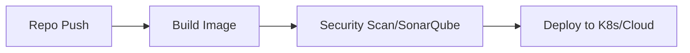

These mock interview sessions cover core concepts in **DevOps, Infrastructure as Code (IaC), and CI/CD pipelines**, with a specific focus on Terraform and Azure. Below are the key questions, modeled answers, feedback, and actionable tips to help you prepare for your real-world interviews.

---

## 1. Technical Interview Questions & Answers

### Topic: Terraform State Management & Drift

**Question:** If you manually modify a resource in the Azure portal, what happens when you run `terraform apply`?

**Answer:** Terraform will detect the discrepancy between your configuration files and the actual infrastructure state. Running `terraform plan` triggers a `terraform refresh` operation, which queries the actual provider API to update the state file. It will then highlight the "drift." If the manual change conflicts with your code, Terraform will propose a plan to revert those changes back to the defined state.

> **Diagram: Drift Correction Flow**
> ```text
> [Terraform Code] --> [Terraform Plan/Refresh] --> [Compare with State]
>                                |
>                   (Discrepancy Found)
>                                |
> [Terraform Apply] <--- [Revert to Code State]
> 
> ```
> 
> 

---

### Topic: Terraform Modular Structure

**Question:** What is a modular structure in Terraform and how do you organize it?

**Answer:** A modular structure organizes infrastructure into reusable, logical components. A root module typically holds the provider configuration. We create separate folders (e.g., `Dev`, `Prod`, `Test`) and call specific modules to maintain consistency across environments.

> **Code Snippet: Directory Organization**

```text
> /root-module
> ├── main.tf        (Provider block)
> ├── variables.tf   (Global variables)
> ├── /modules
> │   ├── /networking
> │   └── /vm
> └── /environments
>     ├── /dev
>     └── /prod
> ```

---

### Topic: CI/CD & Automation
**Question:** What are Azure Pipeline agent pools, and why do you use variable groups?

**Answer:**
*   **Agent Pool:** This is the infrastructure (a set of virtual machines or containers) where the pipeline jobs are executed. You can use Microsoft-hosted agents or set up self-hosted agents for specific security requirements.
*   **Variable Groups:** These are used to store key-value pairs that can be reused across multiple pipelines. This prevents hardcoding sensitive or repetitive information (like connection strings) directly into the YAML files.

> **Code Snippet: Using Variable Groups in YAML**
> 
```yaml
> variables:
> - group: 'Dev-Environment-Variables' # Reusable group
> - name: environment
>   value: 'Dev'
> ```

---

### Topic: Release Management & Governance
**Question:** How do you implement approval gates in your CI/CD pipeline?

**Answer:** You implement manual intervention gates between the `plan` and `apply` phases. After the pipeline triggers a `terraform plan` and stores the output, the execution halts. A manager or lead reviews the plan logs. Once approved, the pipeline proceeds to execute `terraform apply`.

> **Diagram: Approval Pipeline Flow**
> 
```text
> Source Code --> Terraform Plan --> [Manual Approval Gate] --> Terraform Apply
> ```

---

## 2. Interviewer Comments & Feedback

Based on the session, here is the assessment from your interviewer:

*   **Technical Proficiency:** Your technical grasp is strong. You correctly identified key Terraform concepts like drift, state management, and the function of agent pools and variable groups.
*   **Confidence:** You seem hesitant. You frequently use self-deprecating humor or nervous laughter, which can make you appear less experienced than you are.
*   **Demeanor:** You were encouraged to look at the camera rather than the screen to maintain "eye contact" with the interviewer. You were also advised to use active hand gestures while explaining complex topics to show engagement.
*   **Communication:** You occasionally mumble or speak inside your mouth. You were advised to keep your mouth open and speak clearly, as if you are explaining a concept to a team member.

---

## 3. My Tips for Your Success

*   **Own Your Experience:** When you describe a project, don't say "I didn't get a chance to write the pipeline." Instead, say: "I collaborated with the DevOps team to integrate the CI/CD pipeline, and I am deeply familiar with the workflow we implemented."
*   **Control the "Nervous Laugh":** In a high-stakes interview, nervous laughter can undermine your authority on a topic. If you are unsure of an answer, it is better to take a breath and say, "I haven't encountered that specific scenario, but based on my understanding of how Terraform works, I would..."
*   **Visual Communication:** Continue using the "shared screen" for diagrams (as you did with the folder structure). It is an excellent way to keep the interviewer engaged.
*   **Professional Polish:** You mentioned using ChatGPT to help with answers. While practice is good, ensure your answers sound like *you*—don't memorize scripts. Use the structure provided above as a framework, not a rigid script.

---

*Do you want to practice explaining the "State Management" question again to see if you can make it sound more confident?*

```

---

# 7th Part-2

This mock interview session was conducted for a **Senior DevOps Engineer** position. The candidate, Raju Khan, discussed his experience with multi-cloud infrastructure and microservices architecture. Below is the comprehensive review and breakdown of the session.

---

## 1. List of Interview Questions

| # | Question |
| --- | --- |
| 1 | "Can you give me a brief introduction about yourself?" |
| 2 | "What are the best practices in Terraform when you are writing code?" |
| 3 | "If I ask you to create a pipeline from scratch, what are your steps/process?" |
| 4 | "Why use self-hosted agents instead of Azure-hosted agents?" |
| 5 | "What is the difference between Continuous Deployment and Continuous Delivery?" |
| 6 | "What are the different types of providers in Azure?" |

---

## 2. Interview-Ready Answers & Visual Aids

### Q1: Brief Introduction

**Answer:** "I have 5.5 years of experience specifically as a DevOps Engineer, with a total of 10 years in the IT domain. I am currently working at Infinite Computer Solutions, primarily managing multi-cloud environments (Azure/AWS) and supporting two international projects—one for a client in Japan and another for Comcast USA. My core expertise lies in designing CI/CD pipelines, infrastructure provisioning via Terraform, and managing microservices architectures using Docker and Kubernetes."

> **Architecture Diagram:**

```text
[Client/User] -> [React Front-End] -> [Python Back-End API] -> [MongoDB]
                                          |
                                    [Terraform/Cloud]

```

### Q2: Terraform Best Practices

**Answer:** "The most critical practice is to separate your infrastructure into **Modules** and **Environments**. I always structure the project with a folder for reusable modules (compute, storage, network) and separate folders for environments (dev, stage, prod) to prevent configuration drift and ensure code reusability."

> **Code Snippet (Folder Structure):**

```text
/infrastructure
  /modules
    /compute (main.tf, vars.tf)
    /storage (main.tf, vars.tf)
  /environments
    /dev (terraform.tfvars, backend.tf)
    /prod (terraform.tfvars, backend.tf)

```

### Q3: Pipeline Creation Process

**Answer:** "To build a pipeline from scratch, I first define the Dockerfile using a **multi-stage build** to optimize the image size. Once the code is pushed to the repository, I define the YAML pipeline (ADO for Azure or GitHub Actions for AWS). I then configure the stages: **Build**, **Test/Security Scan (SonarQube)**, and **Deployment**."

> **Pipeline Flow:**



### Q4: Self-Hosted vs. Azure-Hosted Agents

**Answer:** "We use self-hosted agents primarily for **customization and security**. Azure-hosted agents are great, but they are generic. With self-hosted agents, I can configure the specific tool versions, security software, and firewall rules required for our specific application, giving us full control over the build environment that managed services cannot provide."

### Q5: Continuous Deployment vs. Continuous Delivery

**Answer:** "Continuous Delivery focuses on ensuring code is always in a deployable state, often requiring manual approval to push to production. Continuous Deployment, however, automates the entire process; every code change that passes the automated tests is deployed to production automatically without human intervention."

### Q6: Types of Providers in Azure

**Answer:** "In the context of Terraform for Azure, we mainly utilize the **AzureRM** provider for resource management, **AzureAD** for identity/access management, and the **Azure API** for interacting with cloud services directly."

---

## 3. Key Topics Covered

* **Infrastructure as Code (IaC):** Terraform modularization and directory structuring.
* **CI/CD Orchestration:** Multi-stage pipeline architecture (Azure DevOps/GitHub Actions).
* **Cloud Operations:** Multi-cloud strategy (Azure and AWS) and self-hosted build agent management.
* **Microservices:** Deployment patterns for 3-tier architectures.
* **DevOps Culture:** Use of SonarQube, security scanning, and automated approvals.

---

## 4. Interviewer Comment & Feedback

The interviewer provided the following constructive feedback for the candidate:

* **Strengths:** Excellent introductory summary, clear communication of total years of experience, and good grasp of the tech stack (Terraform, Azure, AWS, microservices).
* **Weaknesses:**
* **Technical Precision:** When asked about Azure providers, the answer was slightly imprecise. Be careful not to confuse generic cloud providers with specific Terraform provider blocks.
* **Confidence Levels:** The candidate's confidence was high at the start but dipped during deep technical follow-ups.
* **CI/CD Clarity:** The explanation of Continuous Deployment vs. Delivery needs to be sharper and more standardized.


---

## 5. Expert Tips

* **Use the "STAR" Method:** Structure your answers using the **Situation, Task, Action, Result** model, especially for complex architectural questions.
* **Slow Down During Tech Deep-Dives:** When asked about concepts like Terraform providers, take a moment to breathe. It is okay to say, "I have implemented these extensively, but to define them clearly..."
* **Standardize Your Definitions:** Have a "scripted" but natural explanation for core DevOps concepts (like CI/CD). Don't fumble definitions that you use every day.
* **Improve Body Language:** Ensure you are sitting straight and keeping your hands visible. The interviewer specifically noted that leaning back can reduce the perception of active engagement.

---

*Would you like to practice another deep-dive scenario focusing specifically on Terraform troubleshooting?*

---


