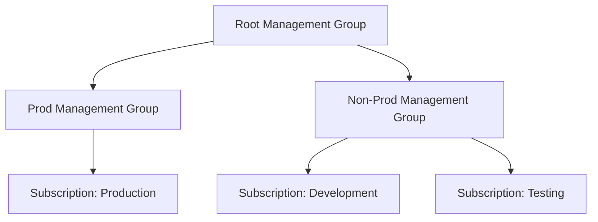
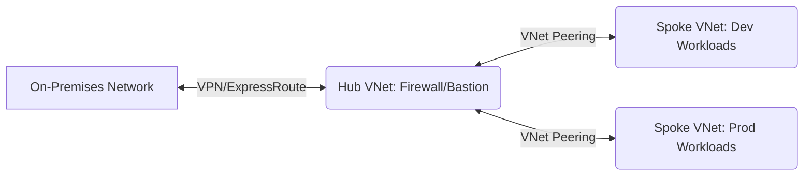
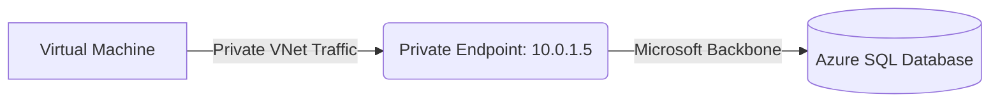

Here is a complete breakdown of the mock interview, including the questions asked, the interviewer's feedback, tailored preparation tips, and structured, interview-ready answers for each technical question.

## Interview Questions Asked

1. How many environments are currently running in your project to manage infrastructure?
2. How are you handling these different environments (Dev, Test, Prod) within your Terraform pipeline?
3. How are you managing Azure Subscriptions across these different environments?
4. If you have multiple variable files in a directory (e.g., `qa.auto.tfvars`, `dev.auto.tfvars`, and `terraform.tfvars`), which file has the highest priority during execution?
5. What networking design or topology would you recommend for an enterprise Azure infrastructure?
6. What is a Private Endpoint, and in what specific scenarios would you use it?
7. What is a NAT Gateway, and why is it used in a cloud network?
8. How would you troubleshoot a Virtual Machine that a client is unable to connect to over the internet?

---

## Interviewer's Feedback

### Feedback for Candidate 1 (Ashish)

* **Introduction Structure:** The introduction lacked a professional structure. Instead of listing team sizes or explaining basic definitions (like what Terraform is), an introduction should cleanly cover your role, years of experience, the specific tools you use (e.g., Terraform), the exact Azure services you provision, and how you integrate them into CI/CD pipelines.
* **Relevance:** Do not waste time explaining what tools do in theory; explain exactly how *you* use them in your daily project tasks to solve business problems.

### Feedback for Candidate 2 (Chetan)

* **Progress:** Showed great improvement in communication and structuring the introduction compared to previous mock sessions.
* **Networking Knowledge Gap:** Struggled significantly with core Azure Networking concepts (NAT Gateway, Private Endpoints, Service Endpoints). In a DevOps role, understanding how to isolate and route traffic securely is just as critical as writing the infrastructure code.
* **Handling Unknowns:** If a specific scenario (like infrastructure migration) has not been part of your direct experience, it is perfectly acceptable to state that. Pivot the conversation to what you *have* migrated (like application workloads) rather than guessing.

---

## Interview-Ready Answers

### 1. Handling Multiple Environments in Terraform

**Answer:** To handle multiple environments like Dev, Test, and Prod, I use Terraform Workspaces. Workspaces allow us to use a single unified configuration directory while maintaining separate, isolated state files for each environment. When I switch to the `prod` workspace, Terraform automatically points to the production state file, ensuring that resource updates do not accidentally overlap or impact the development environment.

```bash
# Creating and switching to a new workspace for production
terraform workspace new prod
terraform workspace select prod

# Applying configuration specific to the active workspace
terraform apply -var-file="prod.tfvars"

```

### 2. Managing Azure Subscriptions

**Answer:** I recommend isolating environments using separate Azure Subscriptions grouped under a unified Management Group hierarchy. For instance, we place the Dev and Test subscriptions under a "Non-Prod" Management Group, and the Prod subscription under a "Prod" Management Group. This provides strict security boundaries, prevents production quota limits from being consumed by testing, and makes cost allocation highly transparent.



### 3. Terraform Variable File Priority

**Answer:** Terraform loads variables in a strict precedence order, where the last file processed overrides any previous values. Files ending in `.auto.tfvars` or `.auto.tfvars.json` are evaluated *after* the standard `terraform.tfvars` file. Therefore, `qa.auto.tfvars` and `dev.auto.tfvars` will have higher priority. If both auto files define the same variable, Terraform processes them in alphabetical order, so `qa.auto.tfvars` would override `dev.auto.tfvars`.

```text
Variable Precedence (Lowest to Highest):
1. Environment variables (TF_VAR_name)
2. terraform.tfvars
3. terraform.tfvars.json
4. *.auto.tfvars or *.auto.tfvars.json (Alphabetical order)
5. -var and -var-file flags passed via CLI

```

### 4. Azure Networking Topology

**Answer:** For an enterprise environment, I heavily recommend the Hub and Spoke network topology. The "Hub" Virtual Network acts as the central point of connectivity and security, hosting shared resources like Azure Firewall, VPN Gateways, and Bastion hosts. The "Spokes" are separate VNets dedicated to specific workloads (like Dev, QA, and Prod). The spokes peer with the Hub to communicate, which centralizes traffic inspection and drastically simplifies network management.



### 5. Private Endpoints

**Answer:** A Private Endpoint is a network interface that assigns a private IP address from your Virtual Network to an Azure PaaS service, such as an Azure SQL Database or Storage Account. We use this when we need to strictly secure data and prevent public internet access to our databases. By using a Private Endpoint, all traffic between our Virtual Machines and the database flows entirely over the Microsoft backbone network, neutralizing public data exfiltration risks.



### 6. NAT Gateway

**Answer:** An Azure NAT Gateway is used to provide highly scalable and secure outbound-only internet connectivity for one or more subnets. It is required in scenarios where Virtual Machines residing in a private subnet (with no public IP addresses) need to reach out to the internet to download software updates or contact external APIs. It ensures these VMs can initiate outbound traffic while completely blocking unsolicited inbound traffic from the internet.

```mermaid
graph TD
    A[Private Subnet VMs] -->|Outbound Request| B{NAT Gateway}
    B -->|Translated to Public IP| C((Public Internet))
    C -.x|Blocked Inbound| B

```

### 7. Troubleshooting Virtual Machine Connectivity

**Answer:** If a client cannot connect to a public-facing VM, I would take a systematic approach. First, I would verify that the VM actually has a Public IP attached and that the VM is in a running state. Second, I would check the Network Security Group (NSG) associated with both the VM's subnet and its Network Interface Card to ensure inbound rules explicitly allow the required port (like 22 for SSH or 3389 for RDP) from the client's IP. Finally, I would use Azure Network Watcher's "IP Flow Verify" tool to test the exact traffic path and identify if a security rule or custom route is blocking the connection.

```bash
# Using Azure CLI to test if traffic is allowed to the VM
az network watcher test-ip-flow \
  --resource-group MyResourceGroup \
  --vm MyVirtualMachine \
  --nic MyNic \
  --direction Inbound \
  --protocol TCP \
  --local 10.0.0.4:22 \
  --remote 203.0.113.5:45678

```

---


## My Interview Preparation Tips

* **Master the "Why," Not Just the "What":** Knowing the definition of an Azure service is not enough. You must be able to articulate *why* you chose it over an alternative (e.g., choosing a Private Endpoint over a Service Endpoint for strict data exfiltration prevention).
* **Hands-On Emulation:** When participating in technical education and professional development services, do not just watch the lectures. Actively build the Hub and Spoke architecture discussed in this interview in a personal Azure tenant to cement your understanding of routing and peering.
* **Refine the Introduction:** Keep your introduction under two minutes. Start with your current title and total experience, immediately follow with your primary tech stack (Azure, Terraform, CI/CD), and end with a high-level summary of your daily responsibilities (e.g., "I manage infrastructure as code and ensure secure, automated deployments").

---

---

# part - 2 
---

Here are the interview-ready answers updated to include highly shareable, screen-friendly code snippets and visual text diagrams for each question. These are designed to quickly demonstrate your technical depth to the interviewer.

### Q1: What happens initially when you run `git init` in a directory?

**Interviewer Feedback:** Ensure you mention the `.git` directory and its significance in tracking history, as that is the core mechanism of how Git operates locally.

**Answer:**
Running `git init` inside a project folder establishes version control by creating a hidden subdirectory named `.git`. This directory acts as the repository's brain, housing all the internal databases, configuration files, and objects necessary for Git to function. Once initialized, Git begins monitoring the workspace so you can start staging and committing files.

**Screen-Share Visual (Terminal Output & Structure):**

```bash
$ git init
Initialized empty Git repository in /my-project/.git/

$ ls -la .git/
drwxr-xr-x   HEAD        # Reference to current branch
drwxr-xr-x   branches/   # Legacy branch tracking
-rw-r--r--   config      # Repo-specific settings
-rw-r--r--   description # Used by GitWeb
drwxr-xr-x   hooks/      # Client/server-side scripts
drwxr-xr-x   info/       # Additional info like exclude rules
drwxr-xr-x   objects/    # The core database of commits/files
drwxr-xr-x   refs/       # Pointers to commits (branches/tags)

```

---

### Q2: How do you practically resolve a merge conflict in Git?

**Interviewer Feedback:** The candidate gave a good explanation, but it’s important to emphasize the communication aspect. Developers shouldn't just resolve conflicts in isolation if they aren't sure whose code should take precedence.

**Answer:**
A merge conflict happens when Git cannot automatically reconcile overlapping changes—usually when two branches modify the same line in a file. To resolve it, I first use `git status` to identify the unmerged files. Then, I open the files and look for Git's standard conflict markers. I manually edit the code to keep the correct logic (often consulting the developer who wrote the incoming changes), remove the markers, save, and finally run `git add` and `git commit` to finalize the merge.

**Screen-Share Visual (Conflict Marker Code Snippet):**

```html
<<<<<<< HEAD
<button class="btn-primary" id="submit">Submit Payment</button>
=======
<button class="btn-secondary" id="checkout">Confirm Order</button>
>>>>>>> feature/checkout-ui-update


```

---

### Q3: What is the difference between `git merge` and `git rebase`?

**Interviewer Feedback:** The candidate’s understanding of `rebase` was slightly inaccurate initially. It's crucial to understand that rebase *rewrites* history rather than just moving commits.

**Answer:**
Both commands integrate changes from one branch to another, but they treat history differently. `git merge` takes a source branch and ties it into a target branch via a new "merge commit." This preserves the exact chronological history but can create a messy, web-like commit graph. `git rebase`, however, rewrites history by taking the commits from your feature branch and replaying them brand new on top of the target branch. This creates a clean, linear history, but it should never be used on shared branches because rewriting public history will break other developers' local repositories.

**Screen-Share Visual (ASCII History Flowchart):**

```text
INITIAL STATE:
      A---B---C (main)
           \
            D---E (feature)

AFTER GIT MERGE (Preserves history, adds Merge Commit 'M'):
      A---B---C-------M (main)
           \         /
            D-------E (feature)

AFTER GIT REBASE (Rewrites history, linear progression):
      A---B---C (main)
               \
                D'---E' (feature)

```

---

### Q4: What does the `.git` directory contain?

**Interviewer Feedback:** The candidate missed a few key components. Be sure to mention the `objects` and `refs` directories.

**Answer:**
The `.git` directory is the core data store for the repository. Its most critical components are the `objects` directory, which stores every version of every file, tree, and commit via cryptographic hashes; the `refs` directory, which holds pointers to branches and tags; the `HEAD` file, which tracks what branch you currently have checked out; and the `index` file, which manages the staging area.

**Screen-Share Visual (Directory Architecture Diagram):**

```text
.git/
├── HEAD            # Pointer to the currently active branch
├── index           # Binary file acting as the Staging Area
├── config          # Local user and repository settings
├── hooks/          # Directory for pre/post commit executable scripts
├── objects/        # The Database (Immutable data structure)
│   ├── info/
│   └── pack/       # Compressed objects for efficiency
└── refs/           # Human-readable pointers to object hashes
    ├── heads/      # Your local branches (e.g., main, dev)
    └── tags/       # Release tags (e.g., v1.0.0)

```

---

### Q5: Explain the concept of a "Detached HEAD" state in Git.

**Interviewer Feedback:** The candidate struggled to articulate this clearly. A simple analogy or clear step-by-step explanation would be helpful.

**Answer:**
Normally, the `HEAD` pointer references a branch name (like `main`), which in turn points to the latest commit on that branch. A "Detached HEAD" state occurs when you check out a specific commit hash directly instead of a branch. In this state, `HEAD` points directly to the commit. You can freely look around, test code, or even make experimental commits. However, because these new commits aren't attached to any branch, they will be orphaned and lost if you switch to another branch, unless you explicitly save them by creating a new branch from that state.

**Screen-Share Visual (Terminal State & Reference Logic):**

```bash
# Entering Detached HEAD state
$ git checkout 5b3a2f8

Note: switching to '5b3a2f8'.
You are in 'detached HEAD' state. You can look around, make experimental
changes and commit them...

# The logic of what happened:
# NORMAL STATE:   HEAD -> refs/heads/main -> commit(5b3a2f8)
# DETACHED STATE: HEAD -> commit(5b3a2f8)

# To save experimental work done here:
$ git switch -c new-experimental-branch

```

---

### Senior Architect Feedback & Tips

When demonstrating your skills during technical platform assessments or live interviews, sharing your screen to walk through terminal outputs or ASCII flowcharts shows strong, pragmatic foundational knowledge.

**Key Takeaways for Your Next Round:**

* **Show, Don't Just Tell:** Keep terminal snippets handy. Explaining `git rebase` is good, but sketching the `D'---E'` linear progression on a shared whiteboard or text editor instantly proves you understand that the commits are entirely rewritten entities, not just moved blocks.
* **Emphasize Collaboration:** Version control is a communication tool above all else. When discussing merge conflicts, always highlight the human element—mentioning that you would coordinate with the specific developer who wrote the overlapping code shows maturity and team readiness.
* **Master the Internals:** Continuing to dive into the architecture of the `.git/objects` and `refs` will naturally make commands like `checkout`, `reset`, and `revert` feel intuitive rather than memorized.


