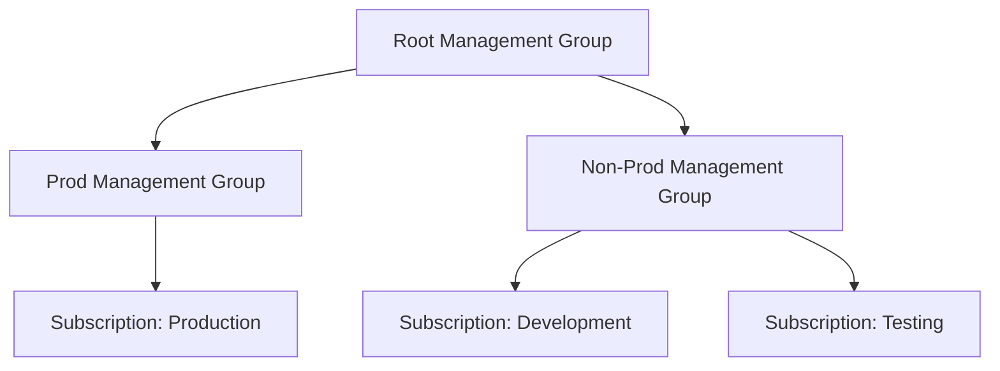
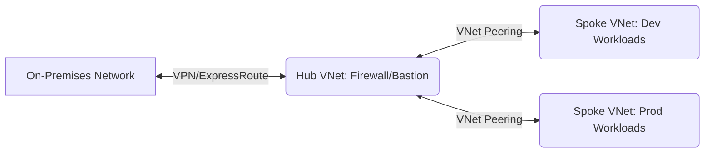
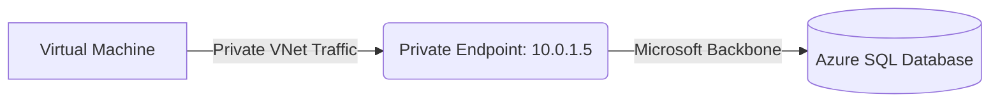

Here is a complete breakdown of the mock interview, including the questions asked, the interviewer's feedback, tailored preparation tips, and structured, interview-ready answers for each technical question.

## Interview Questions Asked

1. How many environments are currently running in your project to manage infrastructure?
2. How are you handling these different environments (Dev, Test, Prod) within your Terraform pipeline?
3. How are you managing Azure Subscriptions across these different environments?
4. If you have multiple variable files in a directory (e.g., `qa.auto.tfvars`, `dev.auto.tfvars`, and `terraform.tfvars`), which file has the highest priority during execution?
5. What networking design or topology would you recommend for an enterprise Azure infrastructure?
6. What is a Private Endpoint, and in what specific scenarios would you use it?
7. What is a NAT Gateway, and why is it used in a cloud network?
8. How would you troubleshoot a Virtual Machine that a client is unable to connect to over the internet?

---

## Interviewer's Feedback

### Feedback for Candidate 1 (Ashish)

* **Introduction Structure:** The introduction lacked a professional structure. Instead of listing team sizes or explaining basic definitions (like what Terraform is), an introduction should cleanly cover your role, years of experience, the specific tools you use (e.g., Terraform), the exact Azure services you provision, and how you integrate them into CI/CD pipelines.
* **Relevance:** Do not waste time explaining what tools do in theory; explain exactly how *you* use them in your daily project tasks to solve business problems.

### Feedback for Candidate 2 (Chetan)

* **Progress:** Showed great improvement in communication and structuring the introduction compared to previous mock sessions.
* **Networking Knowledge Gap:** Struggled significantly with core Azure Networking concepts (NAT Gateway, Private Endpoints, Service Endpoints). In a DevOps role, understanding how to isolate and route traffic securely is just as critical as writing the infrastructure code.
* **Handling Unknowns:** If a specific scenario (like infrastructure migration) has not been part of your direct experience, it is perfectly acceptable to state that. Pivot the conversation to what you *have* migrated (like application workloads) rather than guessing.

---

## Interview-Ready Answers

### 1. Handling Multiple Environments in Terraform

**Answer:** To handle multiple environments like Dev, Test, and Prod, I use Terraform Workspaces. Workspaces allow us to use a single unified configuration directory while maintaining separate, isolated state files for each environment. When I switch to the `prod` workspace, Terraform automatically points to the production state file, ensuring that resource updates do not accidentally overlap or impact the development environment.

```bash
# Creating and switching to a new workspace for production
terraform workspace new prod
terraform workspace select prod

# Applying configuration specific to the active workspace
terraform apply -var-file="prod.tfvars"

```

### 2. Managing Azure Subscriptions

**Answer:** I recommend isolating environments using separate Azure Subscriptions grouped under a unified Management Group hierarchy. For instance, we place the Dev and Test subscriptions under a "Non-Prod" Management Group, and the Prod subscription under a "Prod" Management Group. This provides strict security boundaries, prevents production quota limits from being consumed by testing, and makes cost allocation highly transparent.



### 3. Terraform Variable File Priority

**Answer:** Terraform loads variables in a strict precedence order, where the last file processed overrides any previous values. Files ending in `.auto.tfvars` or `.auto.tfvars.json` are evaluated *after* the standard `terraform.tfvars` file. Therefore, `qa.auto.tfvars` and `dev.auto.tfvars` will have higher priority. If both auto files define the same variable, Terraform processes them in alphabetical order, so `qa.auto.tfvars` would override `dev.auto.tfvars`.

```text
Variable Precedence (Lowest to Highest):
1. Environment variables (TF_VAR_name)
2. terraform.tfvars
3. terraform.tfvars.json
4. *.auto.tfvars or *.auto.tfvars.json (Alphabetical order)
5. -var and -var-file flags passed via CLI

```

### 4. Azure Networking Topology

**Answer:** For an enterprise environment, I heavily recommend the Hub and Spoke network topology. The "Hub" Virtual Network acts as the central point of connectivity and security, hosting shared resources like Azure Firewall, VPN Gateways, and Bastion hosts. The "Spokes" are separate VNets dedicated to specific workloads (like Dev, QA, and Prod). The spokes peer with the Hub to communicate, which centralizes traffic inspection and drastically simplifies network management.



### 5. Private Endpoints

**Answer:** A Private Endpoint is a network interface that assigns a private IP address from your Virtual Network to an Azure PaaS service, such as an Azure SQL Database or Storage Account. We use this when we need to strictly secure data and prevent public internet access to our databases. By using a Private Endpoint, all traffic between our Virtual Machines and the database flows entirely over the Microsoft backbone network, neutralizing public data exfiltration risks.



### 6. NAT Gateway

**Answer:** An Azure NAT Gateway is used to provide highly scalable and secure outbound-only internet connectivity for one or more subnets. It is required in scenarios where Virtual Machines residing in a private subnet (with no public IP addresses) need to reach out to the internet to download software updates or contact external APIs. It ensures these VMs can initiate outbound traffic while completely blocking unsolicited inbound traffic from the internet.

```mermaid
graph TD
    A[Private Subnet VMs] -->|Outbound Request| B{NAT Gateway}
    B -->|Translated to Public IP| C((Public Internet))
    C -.x|Blocked Inbound| B

```

### 7. Troubleshooting Virtual Machine Connectivity

**Answer:** If a client cannot connect to a public-facing VM, I would take a systematic approach. First, I would verify that the VM actually has a Public IP attached and that the VM is in a running state. Second, I would check the Network Security Group (NSG) associated with both the VM's subnet and its Network Interface Card to ensure inbound rules explicitly allow the required port (like 22 for SSH or 3389 for RDP) from the client's IP. Finally, I would use Azure Network Watcher's "IP Flow Verify" tool to test the exact traffic path and identify if a security rule or custom route is blocking the connection.

```bash
# Using Azure CLI to test if traffic is allowed to the VM
az network watcher test-ip-flow \
  --resource-group MyResourceGroup \
  --vm MyVirtualMachine \
  --nic MyNic \
  --direction Inbound \
  --protocol TCP \
  --local 10.0.0.4:22 \
  --remote 203.0.113.5:45678

```

---


## My Interview Preparation Tips

* **Master the "Why," Not Just the "What":** Knowing the definition of an Azure service is not enough. You must be able to articulate *why* you chose it over an alternative (e.g., choosing a Private Endpoint over a Service Endpoint for strict data exfiltration prevention).
* **Hands-On Emulation:** When participating in technical education and professional development services, do not just watch the lectures. Actively build the Hub and Spoke architecture discussed in this interview in a personal Azure tenant to cement your understanding of routing and peering.
* **Refine the Introduction:** Keep your introduction under two minutes. Start with your current title and total experience, immediately follow with your primary tech stack (Azure, Terraform, CI/CD), and end with a high-level summary of your daily responsibilities (e.g., "I manage infrastructure as code and ensure secure, automated deployments").

---

---

# part - 2 
---

Here are the interview-ready answers updated to include highly shareable, screen-friendly code snippets and visual text diagrams for each question. These are designed to quickly demonstrate your technical depth to the interviewer.

### Q1: What happens initially when you run `git init` in a directory?

**Interviewer Feedback:** Ensure you mention the `.git` directory and its significance in tracking history, as that is the core mechanism of how Git operates locally.

**Answer:**
Running `git init` inside a project folder establishes version control by creating a hidden subdirectory named `.git`. This directory acts as the repository's brain, housing all the internal databases, configuration files, and objects necessary for Git to function. Once initialized, Git begins monitoring the workspace so you can start staging and committing files.

**Screen-Share Visual (Terminal Output & Structure):**

```bash
$ git init
Initialized empty Git repository in /my-project/.git/

$ ls -la .git/
drwxr-xr-x   HEAD        # Reference to current branch
drwxr-xr-x   branches/   # Legacy branch tracking
-rw-r--r--   config      # Repo-specific settings
-rw-r--r--   description # Used by GitWeb
drwxr-xr-x   hooks/      # Client/server-side scripts
drwxr-xr-x   info/       # Additional info like exclude rules
drwxr-xr-x   objects/    # The core database of commits/files
drwxr-xr-x   refs/       # Pointers to commits (branches/tags)

```

---

### Q2: How do you practically resolve a merge conflict in Git?

**Interviewer Feedback:** The candidate gave a good explanation, but it’s important to emphasize the communication aspect. Developers shouldn't just resolve conflicts in isolation if they aren't sure whose code should take precedence.

**Answer:**
A merge conflict happens when Git cannot automatically reconcile overlapping changes—usually when two branches modify the same line in a file. To resolve it, I first use `git status` to identify the unmerged files. Then, I open the files and look for Git's standard conflict markers. I manually edit the code to keep the correct logic (often consulting the developer who wrote the incoming changes), remove the markers, save, and finally run `git add` and `git commit` to finalize the merge.

**Screen-Share Visual (Conflict Marker Code Snippet):**

```html
<<<<<<< HEAD
<button class="btn-primary" id="submit">Submit Payment</button>
=======
<button class="btn-secondary" id="checkout">Confirm Order</button>
>>>>>>> feature/checkout-ui-update


```

---

### Q3: What is the difference between `git merge` and `git rebase`?

**Interviewer Feedback:** The candidate’s understanding of `rebase` was slightly inaccurate initially. It's crucial to understand that rebase *rewrites* history rather than just moving commits.

**Answer:**
Both commands integrate changes from one branch to another, but they treat history differently. `git merge` takes a source branch and ties it into a target branch via a new "merge commit." This preserves the exact chronological history but can create a messy, web-like commit graph. `git rebase`, however, rewrites history by taking the commits from your feature branch and replaying them brand new on top of the target branch. This creates a clean, linear history, but it should never be used on shared branches because rewriting public history will break other developers' local repositories.

**Screen-Share Visual (ASCII History Flowchart):**

```text
INITIAL STATE:
      A---B---C (main)
           \
            D---E (feature)

AFTER GIT MERGE (Preserves history, adds Merge Commit 'M'):
      A---B---C-------M (main)
           \         /
            D-------E (feature)

AFTER GIT REBASE (Rewrites history, linear progression):
      A---B---C (main)
               \
                D'---E' (feature)

```

---

### Q4: What does the `.git` directory contain?

**Interviewer Feedback:** The candidate missed a few key components. Be sure to mention the `objects` and `refs` directories.

**Answer:**
The `.git` directory is the core data store for the repository. Its most critical components are the `objects` directory, which stores every version of every file, tree, and commit via cryptographic hashes; the `refs` directory, which holds pointers to branches and tags; the `HEAD` file, which tracks what branch you currently have checked out; and the `index` file, which manages the staging area.

**Screen-Share Visual (Directory Architecture Diagram):**

```text
.git/
├── HEAD            # Pointer to the currently active branch
├── index           # Binary file acting as the Staging Area
├── config          # Local user and repository settings
├── hooks/          # Directory for pre/post commit executable scripts
├── objects/        # The Database (Immutable data structure)
│   ├── info/
│   └── pack/       # Compressed objects for efficiency
└── refs/           # Human-readable pointers to object hashes
    ├── heads/      # Your local branches (e.g., main, dev)
    └── tags/       # Release tags (e.g., v1.0.0)

```

---

### Q5: Explain the concept of a "Detached HEAD" state in Git.

**Interviewer Feedback:** The candidate struggled to articulate this clearly. A simple analogy or clear step-by-step explanation would be helpful.

**Answer:**
Normally, the `HEAD` pointer references a branch name (like `main`), which in turn points to the latest commit on that branch. A "Detached HEAD" state occurs when you check out a specific commit hash directly instead of a branch. In this state, `HEAD` points directly to the commit. You can freely look around, test code, or even make experimental commits. However, because these new commits aren't attached to any branch, they will be orphaned and lost if you switch to another branch, unless you explicitly save them by creating a new branch from that state.

**Screen-Share Visual (Terminal State & Reference Logic):**

```bash
# Entering Detached HEAD state
$ git checkout 5b3a2f8

Note: switching to '5b3a2f8'.
You are in 'detached HEAD' state. You can look around, make experimental
changes and commit them...

# The logic of what happened:
# NORMAL STATE:   HEAD -> refs/heads/main -> commit(5b3a2f8)
# DETACHED STATE: HEAD -> commit(5b3a2f8)

# To save experimental work done here:
$ git switch -c new-experimental-branch

```

---

### Senior Architect Feedback & Tips

When demonstrating your skills during technical platform assessments or live interviews, sharing your screen to walk through terminal outputs or ASCII flowcharts shows strong, pragmatic foundational knowledge.

**Key Takeaways for Your Next Round:**

* **Show, Don't Just Tell:** Keep terminal snippets handy. Explaining `git rebase` is good, but sketching the `D'---E'` linear progression on a shared whiteboard or text editor instantly proves you understand that the commits are entirely rewritten entities, not just moved blocks.
* **Emphasize Collaboration:** Version control is a communication tool above all else. When discussing merge conflicts, always highlight the human element—mentioning that you would coordinate with the specific developer who wrote the overlapping code shows maturity and team readiness.
* **Master the Internals:** Continuing to dive into the architecture of the `.git/objects` and `refs` will naturally make commands like `checkout`, `reset`, and `revert` feel intuitive rather than memorized.

---

# 2nd part 
--- 
Here is the complete analysis of the mock interview based on the transcript. It includes the technical questions asked, the direct feedback from the interviewer, my strategic feedback as a Senior Architect, and interview-ready answers equipped with a visual, diagram, or code snippet for each.

---

### **Part 1: Interviewer's Direct Feedback**

Throughout the interview, the interviewer provided several critical pieces of constructive feedback:

* **Camera Etiquette & Body Language:** Do not look away or around the room while answering. Look directly into the laptop camera to maintain virtual eye contact and project confidence.
* **Use Concrete Examples:** When explaining concepts (like Terraform dependencies), do not use abstract examples like "Resource A depends on Resource B." Use real-world infrastructure examples, such as "A Virtual Machine requires a Virtual Network and a Subnet to be created first."
* **Explain the "Why":** Before explaining *how* a tool works, explain its default behavior. For instance, before explaining `depends_on`, explicitly mention that Terraform provisions resources in parallel by default.
* **Expand Your Scope:** The interviewer strongly suggested studying Azure Active Directory (now Entra ID) alongside Azure Resource Manager (ARM), as IAM and operations go hand-in-hand in real-world Cloud Engineering.
* **Leverage Academic/Demo Projects:** As a fresher, you must heavily rely on your demo projects. Explain the exact architecture you built (e.g., using Terraform to automate VM deployment) rather than just stating you did a project.
* **Professional Environment:** Ensure your mobile phone is completely silenced to avoid disruptions during the interview.

---

### **Part 2: Senior Architect Feedback & Tips**

As a Senior Architect evaluating this mock session, here is my candid advice for cracking actual technical rounds:

* **Own the Narrative (The "Yes, and..." Technique):** Do not just give the bare minimum answer. If asked about Hot/Cool storage tiers, answer the question *and* proactively mention **Lifecycle Management Policies** to automate data tiering. This elevates you from a junior operator to an architectural thinker.
* **Master the Fundamentals:** Struggling with basic Linux commands (`rm`, `ls -a`, `top`) or Git branching (`git checkout -b`) is an immediate red flag for Cloud/DevOps roles. Build a cheat sheet and practice these daily until they are muscle memory.
* **Visual Communication:** You are in a remote interview. Offer to share your screen and open a blank Notepad or Excalidraw to quickly type out a 5-line Terraform snippet or draw a box-and-arrow diagram while explaining. It creates a lasting, highly professional impact.
* **Acknowledge and Pivot:** If you do not know a command, do not freeze. Say, *"I don't recall the exact flag right now, but I would use the `man` page or `--help` to find the directory removal flag."* This shows problem-solving skills rather than defeat.

---

### **Part 3: Interview Questions & "Interview-Ready" Answers**

#### **Question 1: Can you explain RBAC (Role-Based Access Control)?**

**Interview-Ready Answer:** RBAC is a security paradigm used to restrict system access to authorized users based on their role within an organization. In cloud environments like Azure or AWS, instead of assigning permissions to individuals directly, we define a role (which contains a set of allowed and denied actions) and assign that role to a security group. Users are then added to the group. This ensures the Principle of Least Privilege and makes access lifecycle management scalable.

**Visual Representation:**

```text
+----------------+       +-------------------+       +-----------------------+
|   User (Bob)   | ----> |   Group (DBAs)    | ----> | Role (DB Contributor) |
+----------------+       +-------------------+       +-----------------------+
                                                                |
                                                                v
                                                     +-----------------------+
                                                     | Resource (Azure SQL)  |
                                                     +-----------------------+

```

#### **Question 2: How do you assign a "Contributor" role to a user without giving them delete permissions?**

**Interview-Ready Answer:** The default "Contributor" role allows users to manage all resources, including deletion. To fulfill this requirement, I would create a **Custom RBAC Role**. I would clone the base Contributor JSON definition and explicitly add the delete actions (e.g., `Microsoft.Resources/*/delete`) into the `NotActions` array. I would then assign this custom role to an Azure AD group and add the user to it.

**Code Snippet:**

```json
{
  "Name": "Contributor-No-Delete",
  "IsCustom": true,
  "Description": "Can manage all resources but cannot delete them.",
  "Actions": [
    "*"
  ],
  "NotActions": [
    "Microsoft.Authorization/*/Delete",
    "Microsoft.Resources/subscriptions/resourceGroups/delete",
    "Microsoft.Compute/*/delete"
  ],
  "AssignableScopes": [
    "/subscriptions/your-subscription-id"
  ]
}

```

#### **Question 3: What are Hot, Cool, and Archive storage types?**

**Interview-Ready Answer:** These are access tiers in object storage services (like Azure Blob) used to optimize costs based on how frequently data is accessed.

* **Hot Tier:** Best for frequently accessed data. Highest storage cost, lowest access cost.
* **Cool Tier:** Best for data accessed infrequently and stored for at least 30 days (e.g., short-term backups). Lower storage cost, higher access cost.
* **Archive Tier:** Best for rarely accessed data stored for at least 180 days (e.g., compliance logs). Lowest storage cost, highest retrieval cost, and requires a "rehydration" period of several hours to read the data.

**Comparison Table:**

| Feature | Hot Tier | Cool Tier | Archive Tier |
| --- | --- | --- | --- |
| **Usage** | Active/Frequent | Infrequent (Backups) | Rare (Compliance) |
| **Storage Cost** | Highest | Lower | Lowest |
| **Retrieval Cost** | Lowest | Higher | Highest |
| **Latency** | Milliseconds | Milliseconds | Hours (Rehydration) |

#### **Question 4: Why do we use implicit and explicit dependencies in Terraform?**

**Interview-Ready Answer:** By default, Terraform executes resource creation in parallel to save time.

* **Implicit Dependency:** Occurs naturally when one resource references the attribute of another in the code (e.g., a Virtual Machine referencing a Subnet ID). Terraform automatically knows it must build the Subnet first.
* **Explicit Dependency:** Used when a resource relies on another to function, but there is no direct code reference linking them. We use the `depends_on` block to explicitly tell Terraform to wait for the target resource to be fully created before proceeding to prevent deployment crashes.

**Code Snippet:**

```hcl
resource "azurerm_resource_group" "rg" {
  name     = "app-rg"
  location = "East US"
}

resource "azurerm_storage_account" "storage" {
  name                     = "appstorage123"
  resource_group_name      = azurerm_resource_group.rg.name
  location                 = azurerm_resource_group.rg.location
  
  # Explicit Dependency: Forces Terraform to wait for the RG
  depends_on = [
    azurerm_resource_group.rg
  ]
}

```

#### **Question 5: What is a Network Interface Card (NIC) in Cloud Architecture?**

**Interview-Ready Answer:** A NIC is a virtual network interface that serves as the bridge between a Virtual Machine and a Virtual Network (VNet/VPC). It allows the VM to communicate with the internet, other VMs, and on-premises networks. The NIC is where we attach private IP addresses, public IP addresses, and Network Security Groups (NSGs) to control inbound and outbound traffic rules.

**High-Level Diagram (HLD):**

```text
[ Internet ] 
     |
     v
[ Public IP ]
     |
     v
+---------------------------------------------------+
|                   Virtual Network                 |
|  +---------------------------------------------+  |
|  |                    Subnet                   |  |
|  |       +-------+               +------+      |  |
|  |       |  NSG  | ---> [NIC] -> |  VM  |      |  |
|  |       +-------+               +------+      |  |
|  +---------------------------------------------+  |
+---------------------------------------------------+

```

#### **Question 6: How do you list hidden files in Linux?**

**Interview-Ready Answer:** In Linux, hidden files and directories start with a dot (e.g., `.ssh` or `.kube`). To view them alongside regular files, I use the `ls` command with the `-a` (all) flag. In practice, I typically use `ls -la` to see a detailed, long-format list of all hidden and unhidden files, including their permissions, owners, and sizes.

**Terminal Snippet:**

```bash
$ ls -la
drwxr-xr-x  4 user user  4096 Jun 21 10:00 .
drwxr-xr-x 20 user user  4096 Jun 20 15:30 ..
-rw-------  1 user user  1543 Jun 21 09:45 .bash_history  # Hidden file
drwx------  2 user user  4096 Jun 20 16:00 .ssh           # Hidden directory
-rw-r--r--  1 user user   220 Jun 21 10:00 config.txt

```

#### **Question 7: How do you remove a directory in Linux?**

**Interview-Ready Answer:** If the directory is completely empty, I can safely use the `rmdir` command. However, if the directory contains files or subdirectories, I must use the `rm` command with the `-r` (recursive) flag. If I need to forcefully delete it without being prompted for confirmation, I append the `-f` (force) flag, resulting in `rm -rf`.

**Terminal Snippet:**

```bash
# To remove an empty directory:
$ rmdir my_empty_folder/

# To forcefully and recursively remove a directory and all its contents:
$ rm -rf my_project_folder/

```

#### **Question 8: What does the `top` command do?**

**Interview-Ready Answer:** The `top` command provides a dynamic, real-time view of a running Linux system. It displays system metrics like uptime, load averages, total CPU, and RAM usage, followed by a live, sorted list of all active processes. If I am troubleshooting a memory leak, I launch `top` and press `Shift + M` to instantly sort the processes by their memory consumption (`%MEM` column), allowing me to identify and kill the rogue process ID.

**Terminal Snippet:**

```bash
# Command to launch the interactive monitor
$ top

# Expected Header Output
top - 10:13:34 up 10 days,  2:45,  1 user,  load average: 0.05, 0.03, 0.01
Tasks: 110 total,   1 running, 109 sleeping,   0 stopped,   0 zombie
%Cpu(s):  2.5 us,  1.0 sy,  0.0 ni, 96.0 id,  0.5 wa,  0.0 hi,  0.0 si,  0.0 st
MiB Mem :   7965.4 total,   1200.1 free,   4500.3 used,   2265.0 buff/cache

  PID USER      PR  NI    VIRT    RES    SHR S  %CPU  %MEM     TIME+ COMMAND
 1045 root      20   0 2500000 1.250g  12000 S   5.0  16.1   2:30.45 java

```

#### **Question 9: How do you create and switch to a new branch in Git?**

**Interview-Ready Answer:** Traditionally, to create a new branch and switch to it immediately, I use the command `git checkout -b <branch-name>`. In newer versions of Git (2.23+), the `checkout` command's responsibilities were split for clarity, so I prefer using the modern equivalent: `git switch -c <branch-name>`.

**Terminal Snippet:**

```bash
# Modern approach to create and switch to 'feature-auth'
$ git switch -c feature-auth
Switched to a new branch 'feature-auth'

# Traditional approach
$ git checkout -b feature-auth
Switched to a new branch 'feature-auth'

```
---

# Part 4 
---

Here is a comprehensive breakdown of the mock interview from the video, including the interviewers' feedback, the technical questions asked, and highly structured, interview-ready answers.

As a senior architect, I've refined these answers to help you demonstrate deep expertise, and I've included visual aids (diagrams and code snippets) that you can easily share or draw on a whiteboard during a virtual interview.

---

### **Interviewer Feedback from the Session**

The panel (Yamini, Sanjay, Gaurav, and others) provided excellent, candid feedback to the candidates (Shubham and Sanjay) throughout the session.

**Key Takeaways from the Panel:**

* **Don't Over-Explain:** Yamini explicitly warned against over-explaining during your introduction or answers. When you list too many tools or go into unnecessary depth (like explaining service connections or pipeline steps during a basic intro), you hand the interviewer the ammunition to cross-question you on topics you might not be prepared for. Keep it crisp.
* **Control the Narrative:** Bait the interviewer with your strongest skills. Only mention the tools and processes you are extremely confident discussing.
* **Confidence is Key:** The mentors spent significant time calming Shubham down. Interviewers know you might be nervous. Take a breath, treat it like a technical discussion with a colleague, and don't panic if you don't know an exact command.
* **Concepts Over Memorization:** If you forget a specific command (like `git fetch`), explain the *concept* of what you are trying to achieve. Senior roles care more about your architectural understanding than your ability to memorize CLI arguments.

---

### **Technical Questions & Interview-Ready Answers**

#### **Question 1: Give me a brief introduction, your skills, and the project you are currently working on.**

**Context:** The interviewer wants a high-level overview of your experience and to hear the keywords that match their job description.
**Interview-Ready Answer:**

> "I have over 8 years of experience in the IT industry, with the last 4+ years dedicated to DevOps and Cloud Infrastructure. Currently, I work as a Senior DevOps Engineer managing Microsoft Azure environments. My core expertise lies in Infrastructure as Code (IaC) using Terraform, where I heavily utilize a modular approach (Parent/Child modules) to maintain DRY and reusable code. On the CI/CD front, I design and manage pipelines using Azure DevOps and GitHub Actions to automate our build, test, and deployment processes. Recently, I led a project to migrate our monolithic application to a 3-tier architecture on Azure, fully automated via Terraform and CI/CD."

**Visual Aid: High-Level DevOps Architecture**

```text
[Developers] 
     │ (Commit Code)
     ▼
[GitHub / Azure Repos] ──(Triggers)──> [CI/CD Pipeline]
                                            │
                                            ├─> Build & Test
                                            ├─> Security Scan
                                            └─> Terraform Apply
                                                    │
                                                    ▼
                                            [Azure Cloud]
                                            (Web App, DB, VNet)

```

**Senior Architect Tip:** Keep your intro under 2 minutes. The diagram above is a great mental model to have ready if they ask you to draw your current project's flow.

---

#### **Question 2: What is your approach to Terraform? What do you mean by Parent Module and Child Module?**

**Context:** The interviewer is testing if you write flat, messy Terraform code or structured, enterprise-grade code.
**Interview-Ready Answer:**

> "I strictly follow a modular approach in Terraform to ensure code reusability and maintainability.
> * **Child Modules:** These are reusable, generic templates for specific resources (e.g., a standard Azure Storage Account or Virtual Network). They contain their own `main.tf`, `variables.tf`, and `outputs.tf` but do not hardcode specific environment values.
> * **Parent (Root) Module:** This is the main execution point. It calls the child modules using the `source` attribute and passes environment-specific variables into them. This allows us to use the exact same child module logic across multiple projects or environments."
> 
> 

**Visual Aid: Terraform Directory Structure**

```text
terraform-project/
├── modules/                   <-- CHILD MODULES
│   ├── vnet/
│   │   ├── main.tf
│   │   ├── variables.tf
│   │   └── outputs.tf
│   └── storage/
│       ├── main.tf
│       └── variables.tf
├── environments/              <-- PARENT (ROOT) MODULE
│   ├── dev/
│   │   ├── main.tf            <-- Calls modules/vnet and modules/storage
│   │   └── terraform.tfvars   <-- Dev specific values
│   └── prod/
│       ├── main.tf
│       └── terraform.tfvars   <-- Prod specific values

```

**Senior Architect Tip:** Mentioning the DRY (Don't Repeat Yourself) principle here shows you think like an engineer, not just an operator.

---

#### **Question 3: If you have two environments (e.g., Dev and Prod), how will you use the Parent/Child modules so that the same code is deployed to both?**

**Context:** They want to know how you isolate environments safely without duplicating code.
**Interview-Ready Answer:**

> "To deploy the same code across multiple environments, I maintain a single set of Terraform configuration files (the Root Module) that calls the generic Child Modules. To differentiate between Dev and Prod, I use separate variable files, such as `dev.tfvars` and `prod.tfvars`.
> When executing the pipeline, I dynamically pass the specific variables file using the command `terraform apply -var-file="dev.tfvars"`. Most importantly, I ensure strict state isolation by using separate Azure Storage Blob containers or dynamically configuring the backend key so that Dev and Prod state files never overlap."

**Visual Aid: Environment Variable Injection (Code Snippet)**

```bash
# CI/CD Pipeline Execution Step for DEV
terraform init -backend-config="key=dev.terraform.tfstate"
terraform plan -var-file="env/dev.tfvars" -out=dev.plan
terraform apply "dev.plan"

# CI/CD Pipeline Execution Step for PROD
terraform init -backend-config="key=prod.terraform.tfstate"
terraform plan -var-file="env/prod.tfvars" -out=prod.plan
terraform apply "prod.plan"

```

**Senior Architect Tip:** While Terraform Workspaces are a valid answer, many enterprises prefer directory separation or distinct backend keys for production to prevent accidental state corruption. Mentioning state isolation shows maturity.

---

#### **Question 4: What kind of information does the state file have, how do you manage it, and why do we move it to a remote backend?**

**Context:** State management is the most critical part of Terraform.
**Interview-Ready Answer:**

> "The `terraform.tfstate` file is a JSON file that acts as the source of truth. It maps the resources defined in the code to the actual resources deployed in the cloud. It contains metadata, resource IDs, and performance tracking information.
> We **never** store the state file locally. We move it to a Remote Backend (like Azure Blob Storage or AWS S3) for three critical reasons:
> 1. **Collaboration:** It acts as a centralized single source of truth for the entire team or CI/CD pipeline.
> 2. **State Locking:** By using a remote backend, Terraform locks the state file during a run. This prevents two developers or pipelines from modifying the infrastructure at the exact same time, which would cause corruption.
> 3. **Security:** State files can contain sensitive data (like database connection strings). Remote backends allow us to encrypt the state at rest and control access via IAM."
> 
> 

**Visual Aid: State Locking Flow Chart**

```text
[Pipeline A] ---> Runs `terraform apply` 
                      │
                      ▼
[Remote Backend] ---> Acquires State Lock (Status: LOCKED)
                      │
[Pipeline B] ---> Runs `terraform apply`
                      │
                      ▼
[Remote Backend] ---> Sees Lock ---> REJECTS Pipeline B (Prevents Corruption)

```

**Senior Architect Tip:** Emphasize "State Locking" and "Encryption at rest." These are the magic keywords interviewers are listening for.

---

#### **Question 5: What Git branching strategy do you follow, and what is the process before merging code into the main branch?**

**Context:** Testing your understanding of team collaboration, code quality, and release management.
**Interview-Ready Answer:**

> "We follow a Feature Branch Workflow (similar to GitHub Flow). The `main` branch always represents production-ready code.
> When a developer picks up a task, they create a new feature branch from `main`. Once the work is done, they push the code and raise a Pull Request (PR).
> Before the code is merged, two things must happen:
> 1. **Automated Checks:** Our CI pipeline automatically triggers on the PR to run linting, security scans, and a `terraform plan` to ensure the code is valid.
> 2. **Human Review:** At least one senior team member must review and approve the PR. Once approved and checks pass, it is merged into the main branch, which triggers the deployment pipeline."
> 
> 

**Visual Aid: Git Feature Branch Workflow**

```text
(Production)   main   o───────o──────────────────────o (Merge PR)
                       \       \                    /
                        \       o──o (fix-bug)     /
                         \                        /
(Dev Work)     feature    o──o──o (feature-login)/

```

**Senior Architect Tip:** Highlighting the automated checks (Linting, TF Plan) *before* human review shows that you value automation and developer productivity.

---

#### **Question 6: What are the exact Git commands you use to fetch code, create a branch, commit, and push?**

**Context:** A rapid-fire basics check to ensure you actually use the tools you're talking about.
**Interview-Ready Answer:**

> "To synchronize my local repository with the remote, I start with `git fetch` and `git pull`.
> Next, I create and switch to a new working branch using `git checkout -b feature-branch-name`.
> After making my changes, I stage them using `git add .` (or add specific files), and commit them with a descriptive message using `git commit -m "Added new VNet module"`.
> Finally, I push the branch to the remote repository using `git push origin feature-branch-name`."

**Visual Aid: Standard Git CLI Workflow Snippet**

```bash
# 1. Update local tracking of remote branches
git fetch origin

# 2. Create and switch to a new branch
git checkout -b feature/setup-vnet

# 3. Stage changes
git add modules/vnet/main.tf

# 4. Commit changes with a clear message
git commit -m "feat: Add initial VNet configuration"

# 5. Push branch to remote to raise a PR
git push -u origin feature/setup-vnet

```

**Senior Architect Tip:** Mentioning `-u origin <branch>` (setting the upstream tracking) is a nice touch that shows you are comfortable with the CLI.

---


